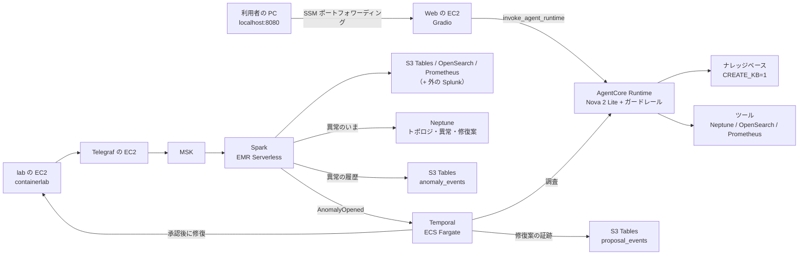

# netops-poc — 閉域 VPC の NetOps PoC（Terraform）

ブラウザのチャットから AgentCore Runtime のエージェントに聞くと、Amazon Nova 2 Lite がトポロジのツール（と任意の手順書の検索）を使って答える。
lab の機器の SNMP とログを Kafka → Spark に流して異常を見つけ、Temporal のワークフローで原因を調べて修復案を出し、人が承認したら直す、までを試せる。
全部を**インターネットに出口の無い VPC** に作る。PC からは SSM のポートフォワーディングで入り、EC2 に受信ルールは無い。



## 作るもの

`deploy.env` で要る機能だけ `1` にする。何も書かなければ土台と AGENT を作る。

| 機能 | できること | 待機の時間課金（東京） |
|---|---|---|
| 土台（必ず） | VPC、Web の EC2、S3、ECR | 約 $0.05/h |
| `AGENT=1`（既定） | チャット（Runtime + ガードレール）。`CREATE_KB=1` で手順書の検索も | 約 $0.13/h（KB は +$0.36/h） |
| `PIPELINE=1` | lab → MSK → Spark → S3 Tables / OpenSearch / Prometheus（`SINK_SPLUNK=1` で外の Splunk にも）、異常検知、Neptune のトポロジ | 約 $1.37/h |
| `WORKFLOW=1` | Temporal で調査 → 承認 → 修復。AGENT と PIPELINE が要る | 約 $0.06/h |

全部で約 $1.61/h。**1 か月置くと約 $1,180（約 17 万円）になるので、使い終わったら当日中に消す。**

## 手順

コマンドは bash 用で、Mac と WSL2 で同じ。**展開したフォルダの直下で打つ。**

1. 道具を入れる: AWS CLI v2、Terraform 1.11 以上、Docker buildx（arm64）、Session Manager plugin、python3 か uv（[setup.md](docs/setup.md)）。
2. AWS に入る: `aws login --profile <プロファイル>`、`aws configure sso`、長期キーのどれか。`sts get-session-token` の一時セッションでは止まる。
3. zip を Linux 側のホームに展開して入る（WSL2 は `/mnt/c` を使わない）。

```bash
unzip ~/netops-poc.zip -d ~ && cd ~/netops-poc
```

4. 設定を写し、空の `OWNER=` に自分の名前を書き、要る機能を `1` にする。

```bash
cp deploy.env.example deploy.env
```

5. 作る。終わると `http://localhost:8080` へのポートフォワーディングが開く。

```bash
ops/up.sh
```

6. 使い終わったら消す。

```bash
ops/down.sh
```

- 所要時間は AGENT だけで 10〜15 分、PIPELINE で 40〜60 分（MSK だけで 20〜30 分）。
- `ops/up.sh` はできているものを飛ばすので、途中で落ちたら打ち直せばよい。
- リージョンは東京（`ap-northeast-1`）で固定。

## よく使うキー

| キー | 何 |
|---|---|
| `OWNER` | **必須。**自分の名前（英小文字で始まる 14 文字まで）。リソース名と `Project` タグが `<owner>-nwc-poc` になる。作ったあとで変えない |
| `AGENT` / `PIPELINE` / `WORKFLOW` / `CREATE_KB` | 作る機能 |
| `SKIP_LAB` / `SKIP_STREAM` / `SKIP_ANALYTICS` / `SKIP_GRAPH` | PIPELINE の一部を外す |
| `IMAGE_TAG` | `agent/` や `workflow/` を変えたら `v2` などに上げる |
| `KEEP_ECR` | `1` で `ops/down.sh` が ECR を残す |

ほかのキーと、`ops/up.sh` / `ops/down.sh` が何をするかは [deploy.md](docs/deploy.md)。その回だけ変えるなら `PIPELINE=1 ops/up.sh` のように環境変数で渡す。

## 注意

- `terraform/<ルート>/terraform.tfstate` を消さない。消すと `ops/down.sh` が消せず、課金が残る。
- up と down は同じ PC で打つ。
- 機能を `0` に戻して打っても、前に作ったものは消えない。消すのは `ops/down.sh` だけ。

## ドキュメント

| ファイル | 中身 |
|---|---|
| [architecture.md](docs/architecture.md) | 構成図、どのファイルがどこで動くか、名前とタグ、ログ |
| [setup.md](docs/setup.md) | 前提（AWS の権限、ネットワーク、Mac / WSL2、社内 PC の CA） |
| [deploy.md](docs/deploy.md) | `deploy.env` の全キー、`ops/up.sh` / `ops/down.sh` の中身、利用者に渡す権限、試す質問 |
| [pipeline.md](docs/pipeline.md) | lab、Spark、Neptune のトポロジの使い方 |
| [workflow.md](docs/workflow.md) | 承認の流れと Temporal UI |
| [troubleshooting.md](docs/troubleshooting.md) | うまくいかないとき |
| [development.md](docs/development.md) | 手元のテスト、変更するときの決まり、Web を手元で動かす |
| [data-stores.md](docs/data-stores.md) | 勉強会メモ: データの置き場（Neptune に「いま」、S3 Tables に履歴と証跡）と DynamoDB をやめた理由、6 つのコンテナイメージの役目と全部 arm64 な理由、Neptune の基礎（Aurora との関係、AZ 冗長、障害をグラフにする意味）、MSK のブートストラップサーバーと `msk-bootstrap` の読み取り（Telegraf だけが SSM を読む理由と IAM の 2 段） |
