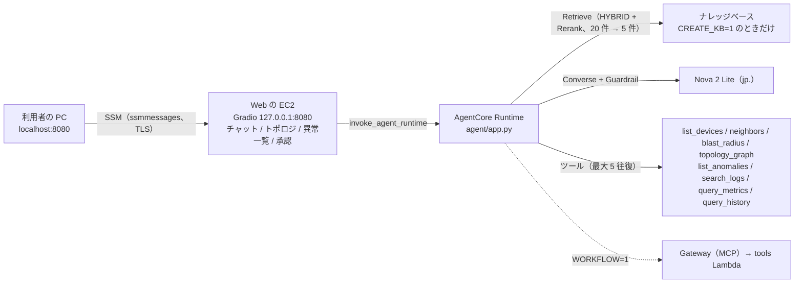
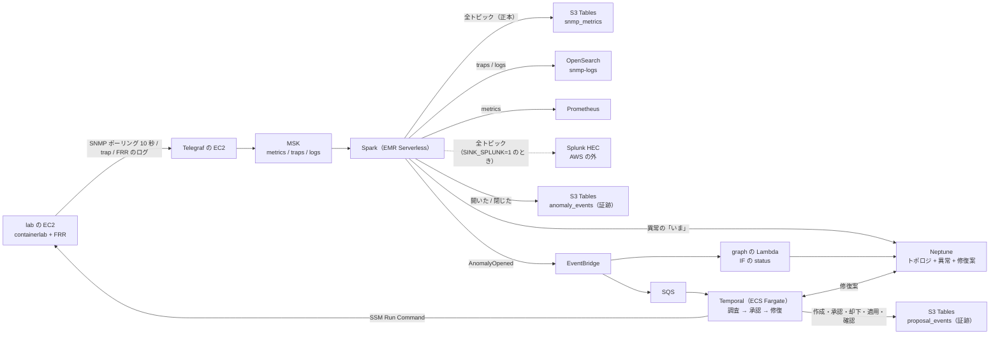

# 構成

← [README](../README.md)

`<prefix>` は `deploy.env` の `OWNER` から作る接頭辞 `<owner>-nwc-poc`。

## チャットの経路



- EC2 にパブリック IP も受信ルールも無い。SSM Agent が内側から ssmmessages へつなぐ。
- Runtime を呼ぶのは EC2 のインスタンスロール。ブラウザに AWS の認証情報は置かない。
- ツールは Neptune（トポロジ・異常・修復案。無ければトポロジは `agent/data/` の静的な 10 台）、OpenSearch Serverless、Prometheus を読む。

## パイプラインと WORKFLOW



WORKFLOW の流れは [workflow.md](workflow.md)、データの置き場は [data-stores.md](data-stores.md)。

## どのファイルがどこで動くか

`app.py` が 2 つあり、動く場所が違う。

| ファイル | 動く場所 | 設定 |
|---|---|---|
| `web/app.py`（と `web/` の他のファイル） | Web の EC2（`<prefix>-web.service`） | `/etc/<prefix>-web.env`。Runtime の ARN は SSM の `<prefix>/runtime-arn` を 60 秒キャッシュで読む |
| `agent/app.py` | AgentCore Runtime のコンテナ | `terraform/agent/runtime.tf` の環境変数 |

**`agent/app.py` を EC2 に置かない。**`KeyError: 'MODEL_ID'` か `404` になり、cloud-init のログに `is not web/app.py` が出る。EC2 のロールに権限を足して直さない。

| パス | 中身 |
|---|---|
| `terraform/` | AWS にリソースを作るのはここだけ（下のツリー） |
| `agent/` | Runtime のエージェントとツール。`data/` は静的トポロジ |
| `web/` | Gradio の画面 |
| `workflow/` | Temporal のワークフローとワーカー |
| `tools/` | Gateway（MCP）の tools Lambda |
| `spark/` | Spark のジョブ（`snmp_sinks.py`） |
| `lab/` | containerlab の構成、FRR、snmpd、Telegraf の EC2 への転送（`lab forward`） |
| `telegraf/` | Telegraf の設定と `tg`（Telegraf の EC2 で動く） |
| `graph/` | Neptune の `status` を書く Lambda |
| `kb-docs/` | ナレッジベースに入れる手順書 |
| `ops/` | `up.sh` / `down.sh` / `check.sh` など |
| `tests/` | 模擬テスト（AWS を呼ばない） |

```
terraform/
├── base/
│   ├── ecr/         ECR リポジトリ
│   └── core/        VPC / SG / エンドポイント / バケット / ロール / Web の EC2
├── agent/         AGENT=1     Runtime / ガードレール / KB
├── pipeline/      PIPELINE=1
│   ├── lab/         containerlab の EC2 と Telegraf の EC2（stream を作るとき）
│   ├── stream/      MSK
│   ├── analytics/   EMR Serverless / S3 Tables / OpenSearch / Prometheus
│   └── graph/       Neptune
└── workflow/      WORKFLOW=1  Temporal on ECS / Gateway（MCP）
```

1 ディレクトリ = 1 state。state は各ルートの `terraform.tfstate`（ローカル）。変数を変えたいときは `terraform.tfvars.example` を `terraform.tfvars` に写す。

## 名前とタグ

- リソース名は `<prefix>-<何>`。Runtime だけはハイフンが使えないので `<owner>_nwc_poc_agent`。
- タグを付けられるものには全部 `Project=<prefix>` と `owner=<owner>` が付く（各ルートの `providers.tf` の `default_tags`）。
- 作ったものの一覧:

```bash
aws resourcegroupstaggingapi get-resources --region ap-northeast-1 \
  --tag-filters Key=Project,Values=<prefix> \
  --query 'ResourceTagMappingList[].ResourceARN' --output table
```

タグが付かないもの: ENI、Runtime のロググループ（`ops/up.sh` の手順 9 で付ける）、OpenSearch Serverless のポリシーとインデックス、KB のデータソース、ガードレールの版。

## ログ

| 何 | どこ |
|---|---|
| エージェントの実行ログ | CloudWatch Logs `/aws/bedrock-agentcore/runtimes/<id>-DEFAULT`（出力 `runtime_log_group_name`、保持 7 日） |
| Web の失敗 | Web の EC2 の `journalctl -u <prefix>-web` |
| ガードレールで止めたか | Runtime のログの `stop=guardrail_intervened` |
| 誰がいつ入ったか | CloudTrail の `StartSession` |

ポートフォワーディングの中身は Session Manager のセッションログに残らない。会話の中身もどこにも保存しない。
