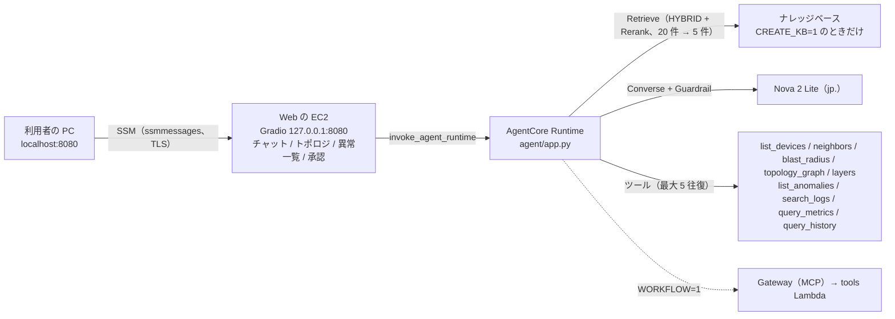
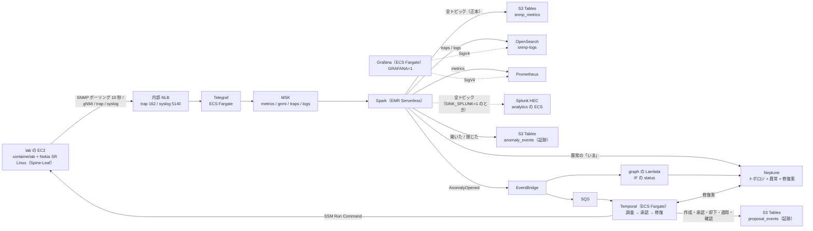

# 構成

← [README](../README.md)

`<prefix>` は `deploy.env` の `OWNER` から作る接頭辞 `<owner>-nwc-poc`。

スライドの構成図は [architecture.pptx](architecture.pptx)。1 枚目は通信の流れ、2 枚目は本番を想定した 2 AZ の配置（PoC は単一 AZ。違いはスライドの注記）。

## チャットの経路


```mermaid
flowchart LR
  PC["利用者の PC<br/>localhost:8080"] -->|"SSM（ssmmessages、TLS）"| WEB["Web の EC2<br/>Gradio 127.0.0.1:8080<br/>チャット / トポロジ / 異常一覧 / 承認"]
  WEB -->|"invoke_agent_runtime"| RT["AgentCore Runtime<br/>agent/app.py"]
  RT -->|"Retrieve（HYBRID + Rerank、20 件 → 5 件）"| KB["ナレッジベース<br/>CREATE_KB=1 のときだけ"]
  RT -->|"Converse + Guardrail"| LLM["Nova 2 Lite（jp.）"]
  RT -->|"ツール（最大 5 往復）"| TOOLS["list_devices / neighbors / blast_radius / topology_graph / layers<br/>list_anomalies / search_logs / query_metrics / query_history"]
  RT -.->|"WORKFLOW=1"| GW["Gateway（MCP）→ tools Lambda"]
```

- EC2 にパブリック IP も受信ルールも無い。SSM Agent が内側から ssmmessages へつなぐ。
- Runtime を呼ぶのは EC2 のインスタンスロール。ブラウザに AWS の認証情報は置かない。
- ツールは Neptune（トポロジ 3 層・異常・修復案。無ければトポロジは `agent/data/` の静的な 8 台と層）、OpenSearch Serverless、Prometheus を読む。

## パイプラインと WORKFLOW


```mermaid
flowchart LR
  LAB["lab の EC2<br/>containerlab + Nokia SR Linux（Spine-Leaf）"] -->|"SNMP ポーリング 10 秒 / gNMI / trap / syslog"| NLB["内部 NLB<br/>trap 162 / syslog 5140"] --> TG["Telegraf<br/>ECS Fargate"] --> MSK["MSK<br/>metrics / gnmi / traps / logs"]
  MSK --> SPARK["Spark（EMR Serverless）"]
  SPARK -->|"全トピック（正本）"| ICE["S3 Tables<br/>snmp_metrics"]
  SPARK -->|"traps / logs"| OS["OpenSearch<br/>snmp-logs"]
  SPARK -->|"metrics"| PROM["Prometheus"]
  SPARK -.->|"全トピック（SINK_SPLUNK=1 のとき）"| SPL["Splunk HEC<br/>analytics の ECS"]
  GRAF["Grafana（ECS Fargate）<br/>GRAFANA=1"] -.->|"SigV4"| OS
  GRAF -.->|"SigV4"| PROM
  SPARK -->|"開いた / 閉じた"| AEV["S3 Tables<br/>anomaly_events（証跡）"]
  SPARK -->|"異常の「いま」"| NEP["Neptune<br/>トポロジ + 異常 + 修復案"]
  SPARK -->|"AnomalyOpened"| EB["EventBridge"]
  EB --> GL["graph の Lambda<br/>IF の status"] --> NEP
  EB --> SQS["SQS"] --> WF["Temporal（ECS Fargate）<br/>調査 → 承認 → 修復"]
  WF <-->|"修復案"| NEP
  WF -->|"作成・承認・却下・適用・確認"| PEV["S3 Tables<br/>proposal_events（証跡）"]
  WF -->|"SSM Run Command"| LAB
```

- Telegraf は stream の ECS（Fargate ARM64）の 1 タスクで、内部 NLB の後ろにいる。trap（162/udp）はタスクの 1162 へ、syslog（5140/udp）は 5140 へ渡す（非 root なので 1024 未満で受けない）。ポーリングと gNMI はタスクから機器へ直接行く。2026-09-28 に lab の EC2 から移した。
- Grafana と ECS の Splunk は analytics の ECS クラスタ `<prefix>-analytics` のタスクで、Cloud Map の `grafana.<prefix>.internal:3000` / `splunk.<prefix>.internal` で引く。LB は無く、PC からは Web の EC2 を踏み台にした SSM のポートフォワード（`AWS-StartPortForwardingSessionToRemoteHost`）で開く。
- Web は EC2 のまま。Grafana と Splunk の踏み台も兼ねる（ECS にするとタスクの IP が変わり、踏み台にしにくい）。

WORKFLOW の流れは [workflow.md](workflow.md)、データの置き場は [data-stores.md](data-stores.md)。

## 閉域

AWS の API へは全部 VPC エンドポイントから行き、この VPC を通らない呼び出しを拒む。VPC にインターネットへの経路は無い（NAT Gateway も IGW も作らない。Splunk も analytics の ECS に立て、AWS の外へは送らない）。

| 層 | 何をする | どこ |
|---|---|---|
| 経路 | インターフェース型エンドポイント（private DNS）。`ops/up.sh` が機能から選ぶ: 土台 ssm / ssmmessages、AGENT は bedrock-runtime / bedrock-agentcore / ecr.api / ecr.dkr / logs（KB で bedrock-agent-runtime）、lab は ecr、stream は ecr.api / ecr.dkr / logs（Telegraf の ECS）、analytics は s3tables / events / logs（Prometheus で aps-workspaces、Grafana か ECS の Splunk で ecr.api / ecr.dkr）、WORKFLOW は sqs / s3tables / bedrock-agentcore(.gateway) など。S3 は gateway 型（無料）、OpenSearch Serverless は専用の 1 本 | `terraform/base/core/endpoints.tf` |
| エンドポイントポリシー | このアカウントのプリンシパルだけ（盗んだ他のアカウントの鍵で VPC から持ち出す経路を塞ぐ）。S3 の gateway は付けない（dnf と ECR のレイヤーが止まる） | 同上 |
| IAM の Deny | ワークロードのロール全部（Web、Runtime、lab、EMR、ECS（Temporal / Telegraf / Grafana / Splunk）、tools Lambda）に `<prefix>-network-perimeter` を付ける。s3 / s3tables / sqs / ssm / bedrock / events / aps / AgentCore の呼び出しで `aws:SourceVpc` がこの VPC でなければ拒む | `terraform/base/core/perimeter.tf`、各ルートの attachment |
| リソースポリシーの Deny | バケット、S3 Tables のテーブルバケット、SQS（本体と DLQ）、AgentCore の Runtime と Gateway。同じ条件で、どのプリンシパルからでも VPC の外なら拒む | `bucket.tf`、`pipeline/analytics/tables.tf`、`workflow/events.tf`、`workflow/gateway.tf`、`agent/runtime.tf` |

- **拒まないもの**: apply した人（`terraform` を打つ PC は VPC の外なので。PoC の割り切り）、AWS のサービス自身（`aws:PrincipalIsAWSService`）とサービスが代わりに呼ぶもの（`aws:ViaAWSService`。EventBridge → SQS、Bedrock → S3 など）、KB のロール `<prefix>-kb`（取り込みは Bedrock のサービス側で動く）。
- S3 Tables の Iceberg REST は、S3 Tables が裏で呼ぶ API に元の VPC が付かないので `aws:CalledViaLast = s3tables.amazonaws.com` を外してある。
- Neptune と MSK の IAM 認証にはこの条件キーが無いので Deny に入れない（どちらも VPC の中にしか口が無い）。Prometheus のワークスペースはリソースポリシーの Deny を確かめていないので IAM の側だけ。
- apply する人が替わったら、その人が `ops/up.sh` を打ち直す（外すプリンシパルが入れ替わる）。前の人の設定のままバケットに入れないときは [troubleshooting.md](troubleshooting.md) の「閉域」。
- 本番では、apply も VPC の中（CI のランナーなど）から打ち、外す人を無くす。AWS の外（Splunk Cloud など）へ送る必要が出て NAT Gateway を足すなら、出る先を Network Firewall のドメインの許可リストで絞る（この PoC には無い）。

## SG

ワークロードごとに SG を 1 つと、VPC エンドポイント用の `endpoints`。SG もルールも `terraform/base/core/security_groups.tf` にまとめ、ルールは通信の表（`local.sg_flows`）から作る。表に無い通信は受信も送信も通らない。ほかのルートは土台の output `security_group_ids` から自分の SG を読んで付けるだけで、ルールは作らない（SG とルールに時間課金は無いので、機能を作らないときもそろえて作る）。

| 送る側 | 受ける側 | ポート | 何のため |
|---|---|---|---|
| web / lab / telegraf / spark / grafana / splunk / lambda / workflow / runtime | endpoints / S3（プレフィックスリスト） | 443/tcp | AWS の API（インターフェース型）と S3（gateway 型。ECR のレイヤーと dnf も） |
| web / runtime / spark / lambda / workflow | neptune | 8182/tcp | Gremlin（Neptune は IAM 認証） |
| web | grafana / splunk / workflow | 3000 / 8000 / 8233（tcp） | SSM のポートフォワーディング（Grafana / Splunk Web / Temporal UI） |
| telegraf / spark | msk | 9098/tcp | Kafka（IAM 認証） |
| msk | msk | 9092〜9098/tcp | ブローカー同士 |
| spark | spark | 全部の tcp | 1 つのジョブのドライバとエグゼキュータ |
| spark | splunk | 8088/tcp | HEC（`SINK_SPLUNK=1`） |
| telegraf_nlb | telegraf | 1162/udp、5140/udp、8080/tcp | trap・syslog の転送と、NLB のヘルスチェック |
| lab の管理ネットワーク（203.0.113.0/24） | telegraf_nlb | 162/udp、5140/udp | 機器の trap と syslog（lab の EC2 が DNAT するので送り元は機器の IP のまま） |
| telegraf | lab の管理ネットワーク | 161/udp、57400/tcp | SNMP のポーリングと gNMI（VPC のルートで lab の EC2 へ） |

- lab の EC2 が転送する流れは、SG が見る IP が lab の EC2 ではなく機器の管理 IP になる。そこで、相手の ENI の IP が見える側だけを SG の参照で書き（lab の送信は telegraf_nlb へ、lab の受信は telegraf から）、反対側は管理ネットワークの CIDR で書く。
- 開けていないもの: Temporal の gRPC 7233（ワーカーは同じタスクの `localhost`。Temporal も `127.0.0.1` だけで待つ）と Splunk の管理 API 8089。インターネットからの受信は、SG の前に経路が無い。
- DNS（VPC の +2）・IMDS・ECS のタスクメタデータ・Time Sync は SG の対象外なので、表に無くても届く。
- `endpoints` は表の 443 だけを受け、外へは出さない。
- VPC の全 ENI の通信は VPC フローログ（`terraform/base/core/flow_logs.tf`）でロググループ `/<prefix>/vpc-flow-logs` に残る（保存 7 日。集約 60 秒）。表の漏れで拒んだ通信は `action = REJECT` で出る（問い合わせは [troubleshooting.md](troubleshooting.md)）。
- SG の説明（description）を変えると作り直しになり、ENI が付いていると消えない。変えるときは先に `ops/down.sh` を打つ。2026-09-29 より前の state（全部で共有する `internal` 1 つ）が残っていると、`ops/up.sh` は手順 0 の後で止まる。ほかのルートは土台の `security_group_ids` を読むが、無ければ apply の前に止まり（`terraform_remote_state` の postcondition）、destroy は古い state のままでも通る（SG の ID は `try` で読む）。

## どのファイルがどこで動くか

`app.py` が 2 つあり、動く場所が違う。

| ファイル | 動く場所 | 設定 |
|---|---|---|
| `web/app.py`（と `web/` の他のファイル） | Web の EC2（`<prefix>-web.service`） | `/etc/<prefix>-web.env`。Runtime の ARN は SSM の `<prefix>/runtime-arn` を 60 秒キャッシュで読む |
| `agent/app.py` | AgentCore Runtime のコンテナ | `terraform/agent/runtime.tf` の環境変数 |

**`agent/app.py` を EC2 に置かない。**`KeyError: 'MODEL_ID'` か `404` になり、cloud-init のログに `is not web/app.py` が出る。EC2 のロールに権限を足して直さない。

| パス | 中身 |
|---|---|
| `terraform/` | AWS にリソースを作るのはここだけ（下のツリー） |
| `agent/` | Runtime のエージェントとツール。`data/` は静的トポロジ |
| `web/` | Gradio の画面 |
| `workflow/` | Temporal のワークフローとワーカー |
| `tools/` | Gateway（MCP）の tools Lambda |
| `spark/` | Spark のジョブ（`snmp_sinks.py`） |
| `lab/` | containerlab の構成、SR Linux の設定（`srlinux/*.cli`）、Telegraf（ECS）への転送（`lab forward`） |
| `telegraf/` | Telegraf の `Dockerfile`、設定（`telegraf.conf.in`）と `tg`（stream の ECS のタスクで動く） |
| `grafana/` | Grafana の `Dockerfile` と provisioning（データソースとダッシュボード。analytics の ECS のタスクで動く） |
| `graph/` | Neptune の `status` を書く Lambda |
| `kb-docs/` | ナレッジベースに入れる手順書 |
| `ops/` | `up.sh` / `down.sh` / `check.sh` など |
| `tests/` | 模擬テスト（AWS を呼ばない） |

```
terraform/
├── base/
│   ├── ecr/         ECR リポジトリ
│   └── core/        VPC / VPC エンドポイント / 閉域の Deny（perimeter.tf）/ SG（ワークロードごと。通信の表は security_groups.tf）/ フローログ / バケット / ロール / Web の EC2
├── agent/         AGENT=1     Runtime / ガードレール / KB
├── pipeline/      PIPELINE=1
│   ├── lab/         containerlab の EC2（stream を作るときは Telegraf への転送も）
│   ├── stream/      MSK / Telegraf（ECS Fargate + 内部 NLB）
│   ├── analytics/   EMR Serverless / S3 Tables / OpenSearch / Prometheus / Grafana と Splunk（ECS Fargate）
│   └── graph/       Neptune
└── workflow/      WORKFLOW=1  Temporal on ECS / Gateway（MCP）
```

1 ディレクトリ = 1 state。state は各ルートの `terraform.tfstate`（ローカル）。変数を変えたいときは `terraform.tfvars.example` を `terraform.tfvars` に写す。

## 名前とタグ

- リソース名は `<prefix>-<何>`。Runtime だけはハイフンが使えないので `<owner>_nwc_poc_agent`。
- タグを付けられるものには全部 `Project=<prefix>` と `owner=<owner>` が付く（各ルートの `providers.tf` の `default_tags`）。
- 作ったものの一覧:

```bash
aws resourcegroupstaggingapi get-resources --region ap-northeast-1 \
  --tag-filters Key=Project,Values=<prefix> \
  --query 'ResourceTagMappingList[].ResourceARN' --output table
```

タグが付かないもの: ENI、Runtime のロググループ（`ops/up.sh` の手順 9 で付ける）、OpenSearch Serverless のポリシーとインデックス、KB のデータソース、ガードレールの版。

## ログ

| 何 | どこ |
|---|---|
| エージェントの実行ログ | CloudWatch Logs `/aws/bedrock-agentcore/runtimes/<id>-DEFAULT`（出力 `runtime_log_group_name`、保持 7 日） |
| Web の失敗 | Web の EC2 の `journalctl -u <prefix>-web` |
| ガードレールで止めたか | Runtime のログの `stop=guardrail_intervened` |
| Telegraf | CloudWatch Logs `/ecs/<prefix>-telegraf`（stream の出力 `telegraf_log_group_name`） |
| Grafana / ECS の Splunk | CloudWatch Logs `/ecs/<prefix>-grafana` / `/ecs/<prefix>-splunk` |
| 誰がいつ入ったか | CloudTrail の `StartSession` |

ポートフォワーディングの中身は Session Manager のセッションログに残らない。会話の中身もどこにも保存しない。
