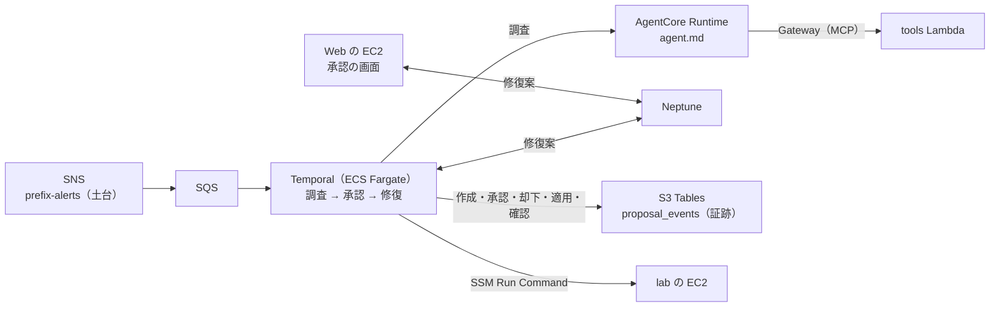

# 構成: ワークフロー（workflow）

← [構成](README.md)

`terraform/workflow`（`WORKFLOW=1`）。Temporal on ECS、SQS（SNS の購読）、Gateway（MCP）と tools Lambda。AGENT と PIPELINE と、アラートの送り手（Grafana か Splunk）が要る。承認の流れと Temporal UI は [workflow.md](../workflow.md)、データの置き場は [data-stores.md](../data-stores.md)。

- アラートは Grafana と Splunk が土台の SNS トピックへ publish し（[pipeline.md](pipeline.md)）、トピックがこの SQS へ配る。SQS のメッセージでワークフローを起こし、解消のアラートで閉じる。
- 修復案の「いま」は Neptune、作成・承認・却下・適用・確認の履歴は S3 Tables の `proposal_events`（証跡）。
- Temporal UI（8233）は Web の EC2 を踏み台にした SSM のポートフォワーディングで開く。gRPC の 7233 はタスクの外に出さない（ワーカーは同じタスクの `localhost`。SG は [core.md](core.md) の「SG」）。
