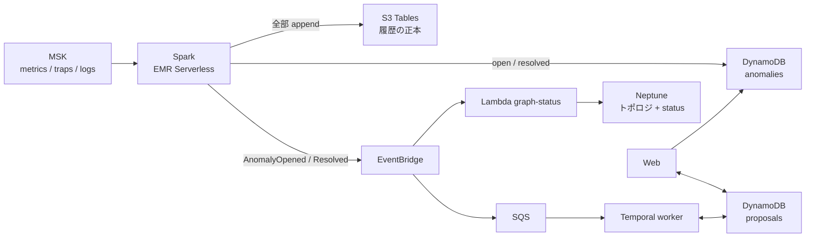

# 勉強会メモ: データの置き場

← [README](../README.md)

この PoC で「何を・どこに・なぜ」置いているかのまとめ。勉強会で話す順に並べてある。2026-09-24 時点のコードで確かめた内容。

## 1. 4 つの置き場

| データ | 置き場 | 書く | 読む |
|---|---|---|---|
| 生データの履歴（metrics / traps / logs の全部） | S3 Tables（Iceberg）`snmp_metrics` | Spark の `iceberg` | まだ読む側が無い（エージェントの `query_history` は Athena 未配備のため案内だけ返す） |
| 異常の「いま」（open / resolved） | DynamoDB `<prefix>-anomalies` | Spark の `detect` | Web の異常一覧、エージェントの `list_anomalies`、worker |
| 修復案と承認の状態 | DynamoDB `<prefix>-proposals` | worker、Web の承認タブ | worker、Web の承認タブ |
| トポロジと、機器・回線の状態 | Neptune | 投入スクリプト、Lambda `graph-status` | エージェントの `neighbors` / `blast_radius` / `topology_graph` |

ほかに、検索用のログ（OpenSearch `snmp-logs`）とグラフ用のメトリクス（Prometheus）がある。この 2 つは見るための写しで、正本ではない。

## 2. 1 回の障害で何が書かれるか

`sudo lab failover` で本社の主回線を落としたときの流れ。

1. **ポーリング（10 秒ごと）:** Telegraf が `ifOperStatus=down` を拾い、MSK の `metrics` に出す。
2. **Spark `iceberg`:** 行をそのまま S3 Tables に追記する。ここは up か down かを判断しない。
3. **Spark `detect`:** anomalies の `hq-ce-01#link_down#eth1`（`<機器>#<種類>#<IF>`）を条件付き更新で開く。
   - すでに open のとき: `last_seen` だけ進める。
   - 無いとき、または resolved のとき: `first_seen` を今にして開き直す。
4. **EventBridge:** `detect` が `AnomalyOpened` を出す。届いたら `notified=true` にする。届かなかったものは、次のバッチで出し直す。
5. **Lambda `graph-status`:** Neptune の IF の頂点の `status` を `DOWN` にする。
6. **worker:** SQS から受け取り、発生ごとに Temporal のワークフローを起こす。発生の id は `<anomaly_id>#<first_seen>`。
7. **修復案:** worker が proposals に `pending` で置く。Web で承認すると `approved`、`heal-main` を打つと `applied`、resolved になると `verified` に進む。
8. **回復:** `detect` が `resolved` にして `AnomalyResolved` を出し、Neptune の `status` が `UP` に戻る。

## 3. なぜ分けているか

| 置き場 | 向いていること | この PoC で使っている機能 |
|---|---|---|
| S3 Tables（Iceberg） | 大量の追記と、後からの集計。安い | Spark の append |
| DynamoDB | 1 行の「いま」を正確に書き換える。放置中はほぼ $0 | 条件付き更新（二重に開かない、人が決めた status を上書きしない）、GSI `status-last_seen-index`（open の新しい順） |
| Neptune | つながりをたどる | 隣接と影響範囲（`blast_radius`）の探索 |

- **設計の記録:** 2026-09-11 と 2026-09-16 の設計で「履歴は S3 Tables、DynamoDB は『いま』として残す」と決めている。
- **Web と Iceberg:** Web は Iceberg を読まない。Athena もまだ配備していないので、S3 Tables は書くだけの状態。

## 4. 穴: 「障害の履歴」はどこにも無い

- S3 に残っているのは生の SNMP と trap。「いつ異常が開いて、いつ閉じたか」は、生データから集計し直さないと出ない。
- anomalies は最新の 1 行しか持たない。開き直すと `first_seen` が上書きされ、前の発生は消える。
- proposals は発生ごとに行が残る。ただし DynamoDB にしか無く、S3 の履歴とつながっていない。

## 5. 論点: Neptune に寄せるか

一本化するなら、次の案になる（未決定）。

1. **異常の「いま」:** Neptune の異常の頂点にし、機器・IF とつなぐ。`detect` が Neptune に書く。
2. **障害の履歴:** `detect` が開いた・閉じたのイベントを S3 Tables の `anomaly_events` に追記する。
3. **修復案:** 異常の頂点にぶら下げる。二重に書かないための条件付き書き込みは、openCypher の `MERGE ... ON CREATE` で置き換える。

| | いま（DynamoDB あり） | 一本化後 |
|---|---|---|
| 置き場の数 | 3 つ（+ 写し 2 つ） | 2 つ（+ 写し 2 つ） |
| 障害の履歴 | 無い | S3 Tables の `anomaly_events` |
| 費用 | DynamoDB は放置中ほぼ $0 | ほとんど変わらない |
| Neptune が止まったとき | トポロジだけ見えない | 検知の書き込みも異常一覧も止まる |
| 直す範囲 | — | `spark/snmp_sinks.py`、`agent/`、`workflow/`、`web/`、tools Lambda、Terraform と IAM、テスト |

話し合いたいこと:
- 異常の「いま」を置く場所として、Neptune の可用性で足りるか。
- 修復案だけは DynamoDB に残す、という分け方は妥当か。
- 異常の履歴（`anomaly_events`）は、一本化と切り離して先に足すか。

## 6. コードの入口

| 見たいもの | ファイル |
|---|---|
| 異常の開閉、イベントの出し直し、trap の TTL | [spark/snmp_sinks.py](../spark/snmp_sinks.py) の `detect` |
| 異常テーブルと GSI | [terraform/pipeline/stream/anomalies.tf](../terraform/pipeline/stream/anomalies.tf) |
| 修復案テーブル | [terraform/workflow/proposals.tf](../terraform/workflow/proposals.tf) |
| worker の読み書き | [workflow/awsio.py](../workflow/awsio.py) |
| Neptune の status | [graph/status_handler.py](../graph/status_handler.py) |
