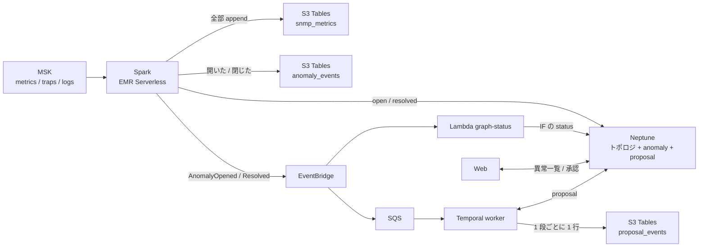
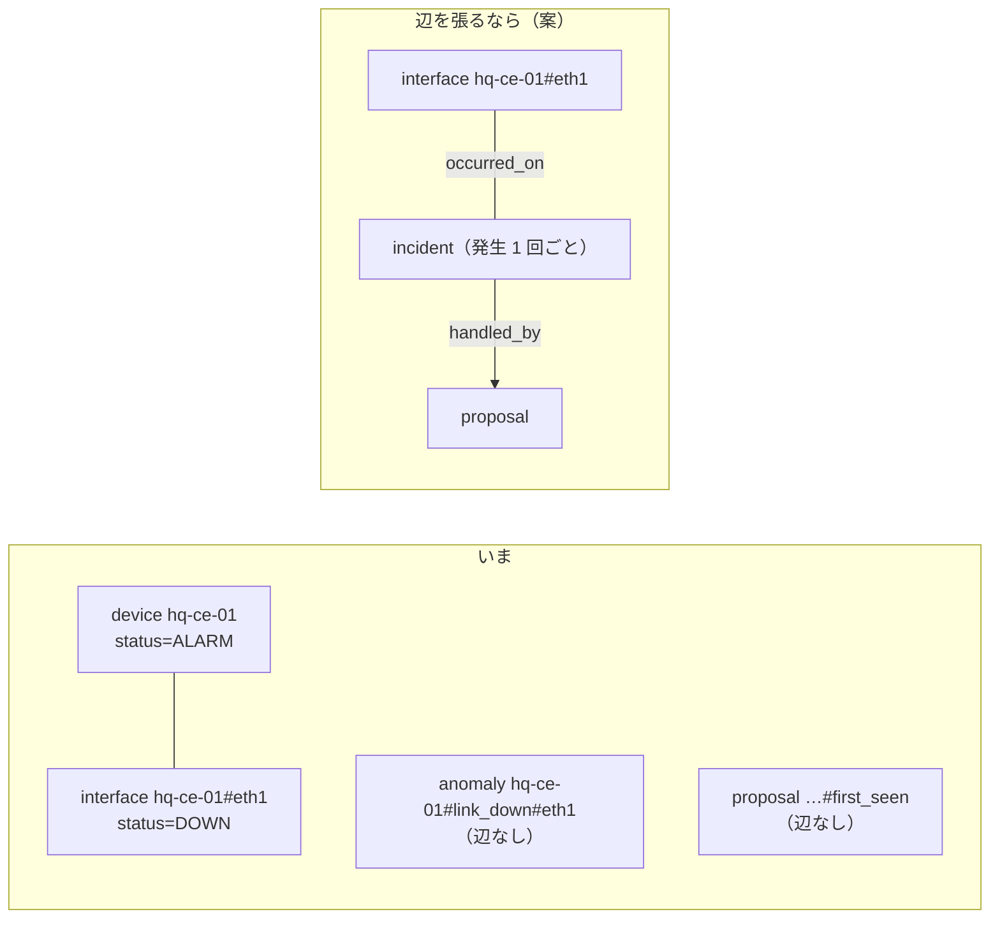

# 勉強会メモ

← [README](../README.md)

勉強会で話す順に並べてある。1〜6 はデータの置き場、7〜10 はコンテナイメージ、11〜14 は Neptune の基礎、15 は MSK とクライアントのつなぎ。

## データの置き場

この PoC で「何を・どこに・なぜ」置いているかのまとめ。2026-09-24 時点のコードで確かめた内容。同じ日に DynamoDB をやめ、「いま」は Neptune、履歴と証跡は S3 Tables に寄せた（5 に経緯）。

### 1. 置き場は 2 つ（+ 見るための写し 2 つ）

| データ | 置き場 | 書く | 読む |
|---|---|---|---|
| 生データの履歴（metrics / traps / logs の全部） | S3 Tables（Iceberg）`snmp_metrics` | Spark の `iceberg` | まだ読む側が無い（エージェントの `query_history` は Athena 未配備のため案内だけ返す） |
| 異常の「いま」（open / resolved） | Neptune の頂点 `anomaly`（id は `<機器>#<種類>#<IF>`） | Spark の `detect` | Web の異常一覧、エージェントの `list_anomalies`、worker |
| 異常の履歴（開いた・閉じた） | S3 Tables `anomaly_events` | Spark の `detect` | まだ読む側が無い（証跡） |
| 修復案の「いま」（pending → approved …） | Neptune の頂点 `proposal`（id は `<anomaly_id>#<first_seen>`） | worker、Web の承認タブ | worker、Web の承認タブ、エージェントの `list_proposals` |
| 修復案の証跡（作成・承認・却下・適用・確認） | S3 Tables `proposal_events` | worker（PyIceberg） | まだ読む側が無い（証跡） |
| トポロジと、機器・回線の状態 | Neptune の頂点 `device` / `interface` | 投入スクリプト、Lambda `graph-status` | エージェントの `neighbors` / `blast_radius` / `topology_graph` |

ほかに、検索用のログ（OpenSearch `snmp-logs`）とグラフ用のメトリクス（Prometheus）がある。この 2 つは見るための写しで、正本ではない。`SINK_SPLUNK=1` なら全トピックを AWS の外の Splunk（HTTP Event Collector）にも送る。これも写しで、Splunk 自体はこのリポジトリの外（docs/pipeline.md）。

### 2. 1 回の障害で何が書かれるか

`sudo lab fail-main` で本社の主回線を落としたときの流れ。

1. **ポーリング（10 秒ごと）:** Telegraf が `ifOperStatus=down` を拾い、MSK の `metrics` に出す。
2. **Spark `iceberg`:** 行をそのまま `snmp_metrics` に追記する。ここは up か down かを判断しない。
3. **Spark `detect`:** 順番は「履歴 → Neptune → イベント」。
   - `anomaly_events` に `opened` の行を足す（`event_id` = `<anomaly_id>#<first_seen>#opened`）。
   - Neptune の `hq-ce-01#link_down#eth1` を開く。すでに open なら `last_seen` だけ進め、無いか resolved なら `first_seen` を今にして開き直す。
   - `AnomalyOpened` を出し、届いたら頂点に `notified=true` を付ける。届かなかったものは次のバッチで出し直す。
4. **Lambda `graph-status`:** Neptune の IF の頂点の `status` を `DOWN` にする。
5. **worker:** SQS から受け取り、発生ごとに Temporal のワークフローを起こす。発生の id は `<anomaly_id>#<first_seen>`。
6. **修復案:** worker が Neptune に `proposal` の頂点を `pending` で置き、`proposal_events` に `created` を足す。
   Web で承認すると頂点が `approved` になり、worker がそれを拾って `approved` の行を足す。`heal-main` を打つと `applied`、resolved になると `verified` の行が続く。
7. **回復:** `detect` が `anomaly_events` に `resolved` を足し、頂点を resolved にして `AnomalyResolved` を出す。Neptune の IF の `status` が `UP` に戻る。

`anomaly_events` の `occurrence_id` と `proposal_events` の `proposal_id` は同じ `<anomaly_id>#<first_seen>` なので、1 回の障害の開閉と修復の流れを突き合わせられる。

### 3. なぜこの分け方か

| 置き場 | 向いていること | この PoC で使っている機能 |
|---|---|---|
| Neptune | つながりをたどる。頂点 1 つの「いま」を書き換える | 隣接と影響範囲（`blast_radius`）の探索。`has('status','pending').property(single, …)` を 1 本の Gremlin にした条件付き更新（人が決めた status を上書きしない） |
| S3 Tables（Iceberg） | 大量の追記と、後からの集計。安い | Spark の append、worker の PyIceberg の append |

- **「いま」と証跡を分ける:** 頂点は書き換わるので、それだけでは「いつ誰が承認したか」が後から追えない。変わるたびに S3 Tables に 1 行足し、上書きしない。
- **Web と Iceberg:** Web は Iceberg を読まない。Athena もまだ配備していないので、S3 Tables は書くだけの状態。

### 4. 気を付けること

- **Neptune が止まると検知も止まる:** `detect` の書き込み、Web の異常一覧、worker が全部 Neptune を見る。以前（DynamoDB）はトポロジが見えなくなるだけだった。
- **承認・却下を書けるのはコードの上だけ:** Neptune の IAM は頂点ごとに絞れず、Runtime と Web のロールはどちらも書ける。チャットから決めさせないのは、`decide` をツールに出していないから（HITL の線はコードで引いている）。
- **証跡は二重に入ることがある:** Spark の読み直しやアクティビティの再試行で同じ行がもう一度入る。集計するときは `event_id` で重複を落とす。
- **worker が止まっているあいだの承認:** Web で承認した事実は頂点にあるが、`proposal_events` の `approved` の行は worker が拾ったときに書く。worker が起きないまま時間が過ぎると、証跡に承認が残らない。Temporal の履歴はタスクと一緒に消える。
- **`ops/down.sh` は証跡も消す:** テーブルバケットごと消えるので、`anomaly_events` と `proposal_events` も残らない。残したいときは消す前に書き出す。
- **SINK_S3=0 でもテーブルバケットはできる:** 証跡の置き場なのでいつも作る（生データの `snmp_metrics` だけが SINK_S3 に従う）。

### 5. 経緯: DynamoDB をやめた（2026-09-24）

それまでは異常の「いま」を DynamoDB `<prefix>-anomalies`、修復案を `<prefix>-proposals` に置いていた。次の穴があった。

- 「いつ異常が開いて、いつ閉じたか」がどこにも無かった。anomalies は最新の 1 行しか持たず、開き直すと前の発生が消えた。
- 修復案の承認・却下が DynamoDB の 1 行にしか無く、上書きで過去が追えなかった。
- 置き場が 3 つ（S3 Tables、DynamoDB、Neptune）あり、同じ異常が DynamoDB と Neptune の両方にあった。

そこで次のように寄せた。

1. **異常の「いま」:** Neptune の頂点 `anomaly`。`detect` が Neptune に書く。
2. **障害の履歴:** `detect` が S3 Tables の `anomaly_events` に追記する。
3. **修復案:** Neptune の頂点 `proposal`。条件付き書き込みは Gremlin の `fold().coalesce(unfold(), addV(...))` と `has('status','pending')` で置き換えた。
4. **修復案の証跡:** worker が S3 Tables の `proposal_events` に 1 段ごとに追記する。

| | 以前（DynamoDB あり） | いま |
|---|---|---|
| 置き場の数 | 3 つ（+ 写し 2 つ） | 2 つ（+ 写し 2 つ） |
| 障害の履歴 | 無い | `anomaly_events` |
| 修復案の証跡 | 無い（1 行を上書き） | `proposal_events` |
| 費用 | DynamoDB は放置中ほぼ $0 | ほとんど変わらない（S3 Tables の小さな追記だけ） |
| Neptune が止まったとき | トポロジだけ見えない | 検知の書き込みも異常一覧も止まる |

### 6. コードの入口

| 見たいもの | ファイル |
|---|---|
| 異常の開閉、履歴の追記、イベントの出し直し、trap の TTL | [spark/snmp_sinks.py](../spark/snmp_sinks.py) の `detect` |
| 証跡のテーブル（`anomaly_events` / `proposal_events`） | [terraform/pipeline/analytics/tables.tf](../terraform/pipeline/analytics/tables.tf) |
| 修復案の頂点と証跡（Terraform 側の説明と IAM） | [terraform/workflow/proposals.tf](../terraform/workflow/proposals.tf)、[terraform/workflow/iam.tf](../terraform/workflow/iam.tf) |
| worker の読み書き（Gremlin と PyIceberg） | [workflow/awsio.py](../workflow/awsio.py) |
| 証跡の 1 行の形 | [workflow/rules.py](../workflow/rules.py) の `proposal_event` |
| Web とエージェントの読み書き | [agent/graph.py](../agent/graph.py) の `list_records` / `get_record` / `update_record` |
| Neptune の IF の status | [graph/status_handler.py](../graph/status_handler.py) |

## コンテナイメージ

ECR に置く 6 つのイメージが「どこで・何をして」いるかのまとめ。2026-09-25 時点のコードで確かめた内容。

### 7. 6 つのイメージと動く場所

| イメージ（`<prefix>-…`） | 元 | 動く場所 | 役目 |
|---|---|---|---|
| `agent` | [agent/](../agent/)（自前ビルド） | AgentCore Runtime | チャットの本体。Bedrock のモデルを呼び、Neptune のトポロジと異常、OpenSearch / Prometheus の証拠を集めて答え、承認待ちの修復案を作る |
| `lab-frr` | `quay.io/frrouting/frr`（ミラー） | lab の EC2（containerlab） | ルーター。`lab/wanlab.clab.yml.in` の機器がこれで立ち、`lab/frr/<機器>.conf` で BGP と IF が入る。監視される「機器」そのもの |
| `lab-snmpd` | [lab/snmpd/](../lab/snmpd/)（自前ビルド） | lab の EC2（containerlab） | net-snmp の snmpd だけの Alpine。FRR に SNMP エージェントが無いので、監視したい機器に `network-mode: container:<機器>` で相乗りさせ、Telegraf のポーリングに答える。**これが付いた機器だけが監視対象** |
| `lab-multitool` | `ghcr.io/srl-labs/network-multitool`（ミラー） | lab の EC2（containerlab） | ping / traceroute / tcpdump 入りの端末役（`hq-host-01` など）。疎通確認と障害の再現に使う |
| `temporal` | `temporalio/temporal`（ミラー） | ECS Fargate（WORKFLOW=1） | Temporal のサーバー。`server start-dev` で 1 コンテナで動く。Fargate はプライベート網から Docker Hub を引けないので ECR にミラーする |
| `worker` | [workflow/](../workflow/)（自前ビルド） | ECS Fargate（WORKFLOW=1） | Temporal のワーカー。SQS の異常を拾い、Runtime に修復案を作らせ、Neptune と S3 Tables に記録し、承認後に SSM で lab の機器へ流して検証する。同じタスクの `temporal` に `localhost:7233` でつなぐ |

分けて見ると、監視される側が `lab-frr` / `lab-snmpd` / `lab-multitool`、考える側が `agent`、実行する側が `temporal` / `worker`。

### 8. 全部 arm64

- **AgentCore Runtime は linux/arm64 のイメージしか動かせない。** x86_64 でビルドしたイメージは起動しない。`agent/Dockerfile` の冒頭にも書いてある。
- ほかも arm64 に揃えてある: ECS Fargate は `cpu_architecture = "ARM64"`（[terraform/workflow/ecs.tf](../terraform/workflow/ecs.tf)）、lab / Telegraf / Web の EC2 は `t4g`（Graviton）だけを受け付ける。
- だから PC 側の `docker buildx build` は必ず `--platform linux/arm64`、`docker pull` も `--platform linux/arm64`。Mac（Apple Silicon）はそのまま、WSL2 は `binfmt` を入れる（[setup.md](setup.md)）。
- ミラーの push で「only the available single-platform image was pushed」と出るのは、arm64 だけ push したという意味で問題ない。

### 9. タグ

- ECR のリポジトリは `IMMUTABLE`（[terraform/base/ecr/main.tf](../terraform/base/ecr/main.tf)）。同じタグへの上書きはできないので、コードを変えたらタグを進める。
- 自前ビルドの `agent` / `worker` は `IMAGE_TAG`（既定 `v1`）、`lab-snmpd` は `ops/up.sh` の `SNMPD_TAG`。ミラーは上流の版そのまま（`ops/up.sh` の `FRR_TAG` / `MULTITOOL_TAG` / `TEMPORAL_TAG`）。
- `ops/up.sh` は ECR にそのタグが無いときだけビルドして push する（手順 2）。

### 10. コードの入口

| 見たいもの | ファイル |
|---|---|
| ビルドと push、タグの定数 | [ops/up.sh](../ops/up.sh) の手順 2 |
| リポジトリの定義 | [terraform/base/ecr/main.tf](../terraform/base/ecr/main.tf) |
| lab のどの機器がどのイメージか | [lab/wanlab.clab.yml.in](../lab/wanlab.clab.yml.in) |
| Runtime がどのイメージを指すか | [terraform/agent/variables.tf](../terraform/agent/variables.tf) の `agent_image_tag` |
| Fargate のタスク定義（temporal と worker の 2 コンテナ） | [terraform/workflow/ecs.tf](../terraform/workflow/ecs.tf) |

## Neptune の基礎

Neptune そのものの仕組みと、この PoC での使い方の関係。2026-09-25 に AWS のドキュメント（[クラスターとインスタンス](https://docs.aws.amazon.com/neptune/latest/userguide/feature-overview-db-clusters.html)、[ストレージ](https://docs.aws.amazon.com/neptune/latest/userguide/feature-overview-storage.html)、[耐障害性](https://docs.aws.amazon.com/neptune/latest/userguide/backup-restore-overview-fault-tolerance.html)、[上限](https://docs.aws.amazon.com/neptune/latest/userguide/limits.html)）とこのリポジトリのコードで確かめた内容。料金は目安で、料金ページでは確かめていない。

### 11. Neptune とは

AWS が運用を持つグラフデータベース。データを頂点と辺で持ち、「A とつながっているものを、さらにその先まで」たどる問い合わせが得意。表の JOIN を何段も重ねずに済む。

| | Neptune Database（この PoC が使う） | Neptune Analytics（使っていない） |
|---|---|---|
| 向き | 少しずつ読み書きする普段の処理 | グラフ全体の分析 |
| 仕組み | Aurora と同じ系統のストレージに置く | メモリに載せて計算する |
| 得意なこと | 頂点 1 つの更新、近くのつながりをたどる | PageRank、コミュニティ検出、最短経路、ベクトル検索 |
| VPC | 要る | 要らない |

- **問い合わせの言語は 3 つ:** Gremlin（手順としてたどり方を書く。この PoC はこれ）、openCypher（`MATCH (a)-[:LINK]->(b)` のように形を描く）、SPARQL（RDF 用）。Gremlin と openCypher は同じプロパティグラフに使える。
- **向いていない:** 表の集計（SQL が無い）、単純なキーと値、時系列、全文検索。
- **費用:** 無料枠は無く、動いているあいだずっと時間で課金される。Serverless でもゼロまでは縮まない。この PoC の `db.t4g.medium` 1 台で約 $0.11/h（[variables.tf](../terraform/pipeline/graph/variables.tf) の説明にある値で、料金 API では未確認）。

### 12. 実体は Aurora か、AZ 冗長か

**ストレージは Aurora と同じ系統、エンジンは Neptune 独自のグラフエンジン。** MySQL や PostgreSQL ではないので SQL は使えない。クラスター・プライマリ・読み取りレプリカ・エンドポイントの考え方は Aurora とほぼ同じ。

| 部分 | 冗長化 |
|---|---|
| ストレージ（クラスターボリューム） | 何もしなくても 3 つの AZ に複製される。AZ が 1 つ落ちてもデータは失われない |
| インスタンス | 書き込みを受けるプライマリは 1 つだけ。読み取りレプリカを最大 15 台足せる。別の AZ にレプリカがあれば、プライマリが落ちたときに昇格して、通常 120 秒以内（60 秒以内のことも多い）に戻る。レプリカが無いと、プライマリを作り直すまで使えない |

この PoC は [neptune.tf](../terraform/pipeline/graph/neptune.tf) で `db.t4g.medium` を 1 台だけ作り、レプリカは無い。**データは AZ 障害でも残るが、サービスはインスタンスの AZ が落ちると作り直すまで止まる**（4 のとおり、止まると検知の書き込みと異常一覧も止まる）。その日に消す使い捨てなので費用を優先している。止めたくないなら別の AZ にレプリカを 1 台足す（インスタンス代はほぼ 2 倍）。

### 13. グラフはいくつ作れるか

- **Neptune Database は 1 クラスター = 1 グラフ。** 1 つのクラスターの中に名前付きの別のグラフを並べる機能は無い（RDF の名前付きグラフは別）。分けたいときは、同じグラフの中でラベルで分けるか、クラスターを分ける（クラスターごとにインスタンス代がかかる）。
- **この PoC はラベルで分けている:** `device` / `interface` / `anomaly` / `proposal` は同じグラフの中にある。ラベルはいくつ増やしてもよく、同じグラフにあるから辺でつなげる。
- **頂点と辺の数に上限は無く、上限はストレージの大きさ:** 1 クラスター最大 128 TiB。増えて効いてくるのは、全件を引く問い合わせ（`g.V().hasLabel('anomaly')` など）の遅さと、ストレージ・I/O の料金。
- Neptune Analytics は「グラフ 1 つ = リソース 1 つ」で、グラフごとに課金される。アカウントあたりの数の上限は Service Quotas で確かめる。

### 14. 障害をグラフにする意味

**いまの形:** 障害は機器の頂点に書き込まず、別の頂点 `anomaly` にしている。1 台に何件も起きうること、open → resolved と自分で状態が進むこと、修復案とつなげたいことが理由。ただし次の 2 点で、まだグラフの強みを使っていない。

1. **頂点は発生 1 回ごとではなく「機器 + 種類 + IF」ごとに 1 つ。** 同じ回線が 2 回落ちると同じ頂点を開き直し、`first_seen` を上書きする（2 の 3）。過去の発生は `anomaly_events` にしか残らない。
2. **機器の頂点と辺でつながっていない。** どの機器の障害かは id の文字列でしか分からない。機器の頂点側には `status`（UP / DOWN / ALARM）が 1 つあるだけ。

**辺でつなぐと楽に答えられる問い:**

- **根本原因の絞り込み:** 同じ時刻に CE 3 台で回線断が出たとき、共通の上流（同じ PE、同じ回線）を探す。表なら段数分の JOIN、グラフなら「共通の隣」を探すだけ。
- **影響範囲とのひも付け:** 障害の頂点から下流へたどって、止まる拠点を出す（いまの `blast_radius` を障害から起こせる）。
- **再発のパターン:** 「この PE につながる回線で過去 30 日に何回落ちたか、毎回同じ修復案で直ったか」。
- **エージェントへの材料集め:** 障害から、つながる機器・同時刻の別の障害・過去に効いた修復案をたどって渡す（GraphRAG と同じ考え方）。

**グラフにしても得をしない問い:** 月の件数、機器ごとのランキング、時系列（表と Athena が向く）。障害 1 件の長いログ（S3 に置き、頂点には場所だけ持たせる）。似た障害のベクトル検索は Neptune Database ではできない（Neptune Analytics か Knowledge Bases が要る）。

**この PoC では:** 十数台のラボで単発の回線断が中心なので、効いているのは影響範囲だけ。複数機器の同時障害（PE 障害で配下の CE がまとめて落ちる）を扱うか、エージェントに原因の推定までさせるなら、辺を張る価値が出る。そのときは「Neptune はいま、S3 Tables は履歴」（3）の分け方も見直すことになる。

## MSK とクライアントのつなぎ

Telegraf・Spark が「どのブローカーにつなぐか」をどう知るか。2026-09-25 に手動構築（手順 5）で確かめた内容。

### 15. msk-bootstrap の読み取り

**ブートストラップサーバーとは。** Kafka のクライアントは、クラスターにつなぐときに「最初に話しかけるブローカーのアドレス一覧」が要る。これがブートストラップサーバーで、`b-1.<クラスター>.kafka.ap-northeast-1.amazonaws.com:9098,b-2.<クラスター>...:9098` のような文字列。クライアントはここに一度つなぐと、クラスター全体の構成（どのブローカーがどのパーティションを持つか）を教えてもらい、以降はそれに従って直接つなぐ。だから全ブローカーを列挙する必要は無いが、MSK はふつう全部を返す。ポート 9098 は SASL/IAM 用（9092 が平文、9094 が TLS、9096 が SASL/SCRAM）。この PoC は IAM だけを有効にしているので 9098 しか使わない。

**なぜ SSM に置くか。** この文字列はクラスターを作り終えるまで決まらない（クラスター名から推測できない乱数が入る）。一方 Telegraf の EC2 は [terraform/pipeline/lab](../terraform/pipeline/lab) で MSK より先に作られ、起動後は自分で設定を組み立てなければならない。そこで [terraform/pipeline/stream/msk.tf](../terraform/pipeline/stream/msk.tf) がクラスターを作った直後に SSM パラメータストアの `/<prefix>/msk-bootstrap`（String）へ書き、Telegraf 側は起動時に `ssm:GetParameter` で読む。手動構築では `aws kafka get-bootstrap-brokers` の `BootstrapBrokerStringSaslIam` を `aws ssm put-parameter` で入れる（手順 5-5）。

**Telegraf 側の流れ**（[telegraf/telegraf.sh](../telegraf/telegraf.sh) の `render`。systemd unit の `ExecStartPre`）。

1. `/etc/<prefix>-telegraf.env` から `AWS_REGION` と `PARAM_PREFIX` を読む。
2. `aws ssm get-parameter --name $PARAM_PREFIX/msk-bootstrap` でブローカーの文字列を取る。**取れなければそこで失敗し、unit の `Restart=on-failure` / `RestartSec=60` で 60 秒ごとに試し直す。** MSK を作る前の Telegraf が「`msk-bootstrap` が読めない」で落ち続けるのはこの仕様で、異常ではない。
3. 取れたら `telegraf.conf.in` の `__KAFKA_BROKERS__` を埋めて `/etc/telegraf/telegraf.conf` を作る。`[[outputs.kafka]]` が metrics / traps / logs の 3 つあり、どれも同じブローカーに `sasl_mechanism = "AWS-MSK-IAM"` でつなぐ。
4. 認証は EC2 のインスタンスプロファイル（ロール `<prefix>-telegraf`）。Telegraf 1.40.0 はプロファイル名を書かないと起動しないので、鍵の無い `[default]`（region だけ）を `/etc/telegraf/aws_config` に置き、SDK が IMDS のロールに落ちるようにしてある。

**IAM は 2 段。** Telegraf のロールに付く `<prefix>-stream-produce`（[terraform/pipeline/stream/access.tf](../terraform/pipeline/stream/access.tf)）は次の 2 文でできている。片方だけでは動かない。

| Sid | 許可 | 使うとき |
|---|---|---|
| `Bootstrap` | `ssm:GetParameter` を `parameter/<prefix>/msk-bootstrap` だけに | 起動時、つなぎ先を知る |
| `Kafka` | `kafka-cluster:Connect` / `DescribeCluster` / `WriteData` / `WriteDataIdempotently` / `DescribeTopic` / `CreateTopic` を「クラスターの ARN」と「`topic/<クラスター>/*`」に | つないだ後、トピックに書く（`auto.create.topics.enable=true` なので初回の書き込みでトピックができる。そのために `CreateTopic` が要る） |

Runtime と Web のロールに付く `<prefix>-stream-parameters-read` は `parameter/<prefix>/*` の読み取りだけで、Kafka の権限は無い（この 2 つは MSK に書かない）。

**ほかのクライアントは SSM を読まない。** 同じ文字列でも渡し方が違う。

| クライアント | ブローカーの知り方 | 理由 |
|---|---|---|
| Telegraf（EC2） | SSM `/<prefix>/msk-bootstrap` を起動時に読む | MSK より先に作られ、自分で起動するから |
| Spark（EMR Serverless） | [terraform/pipeline/analytics](../terraform/pipeline/analytics) が stream の state の `bootstrap_brokers` を読み、ジョブの引数 `--bootstrap` で渡す（[spark/snmp_sinks.py](../spark/snmp_sinks.py)） | ジョブは起動のたびに引数をもらえるので、パラメータストアを引く必要が無い |

**確かめ方。** Telegraf の EC2 に SSM セッションで入り `sudo tg status`。`render` が通ると「`/etc/telegraf/telegraf.conf` を作った（brokers: …）」がログに出て、unit が active になる。`sudo tg test` はポーリングだけを 1 回まわして標準出力に出す（MSK には送らない）ので、機器との疎通と MSK との疎通を切り分けられる。
