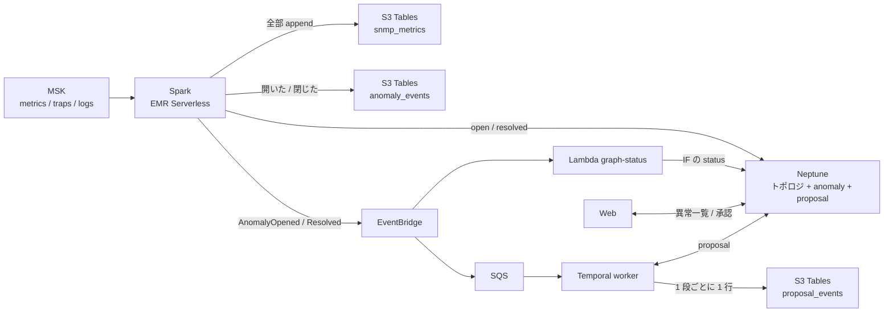

# 勉強会メモ: データの置き場

← [README](../README.md)

この PoC で「何を・どこに・なぜ」置いているかのまとめ。勉強会で話す順に並べてある。2026-09-24 時点のコードで確かめた内容。同じ日に DynamoDB をやめ、「いま」は Neptune、履歴と証跡は S3 Tables に寄せた（5 に経緯）。

## 1. 置き場は 2 つ（+ 見るための写し 2 つ）

| データ | 置き場 | 書く | 読む |
|---|---|---|---|
| 生データの履歴（metrics / traps / logs の全部） | S3 Tables（Iceberg）`snmp_metrics` | Spark の `iceberg` | まだ読む側が無い（エージェントの `query_history` は Athena 未配備のため案内だけ返す） |
| 異常の「いま」（open / resolved） | Neptune の頂点 `anomaly`（id は `<機器>#<種類>#<IF>`） | Spark の `detect` | Web の異常一覧、エージェントの `list_anomalies`、worker |
| 異常の履歴（開いた・閉じた） | S3 Tables `anomaly_events` | Spark の `detect` | まだ読む側が無い（証跡） |
| 修復案の「いま」（pending → approved …） | Neptune の頂点 `proposal`（id は `<anomaly_id>#<first_seen>`） | worker、Web の承認タブ | worker、Web の承認タブ、エージェントの `list_proposals` |
| 修復案の証跡（作成・承認・却下・適用・確認） | S3 Tables `proposal_events` | worker（PyIceberg） | まだ読む側が無い（証跡） |
| トポロジと、機器・回線の状態 | Neptune の頂点 `device` / `interface` | 投入スクリプト、Lambda `graph-status` | エージェントの `neighbors` / `blast_radius` / `topology_graph` |

ほかに、検索用のログ（OpenSearch `snmp-logs`）とグラフ用のメトリクス（Prometheus）がある。この 2 つは見るための写しで、正本ではない。

## 2. 1 回の障害で何が書かれるか

`sudo lab fail-main` で本社の主回線を落としたときの流れ。

1. **ポーリング（10 秒ごと）:** Telegraf が `ifOperStatus=down` を拾い、MSK の `metrics` に出す。
2. **Spark `iceberg`:** 行をそのまま `snmp_metrics` に追記する。ここは up か down かを判断しない。
3. **Spark `detect`:** 順番は「履歴 → Neptune → イベント」。
   - `anomaly_events` に `opened` の行を足す（`event_id` = `<anomaly_id>#<first_seen>#opened`）。
   - Neptune の `hq-ce-01#link_down#eth1` を開く。すでに open なら `last_seen` だけ進め、無いか resolved なら `first_seen` を今にして開き直す。
   - `AnomalyOpened` を出し、届いたら頂点に `notified=true` を付ける。届かなかったものは次のバッチで出し直す。
4. **Lambda `graph-status`:** Neptune の IF の頂点の `status` を `DOWN` にする。
5. **worker:** SQS から受け取り、発生ごとに Temporal のワークフローを起こす。発生の id は `<anomaly_id>#<first_seen>`。
6. **修復案:** worker が Neptune に `proposal` の頂点を `pending` で置き、`proposal_events` に `created` を足す。
   Web で承認すると頂点が `approved` になり、worker がそれを拾って `approved` の行を足す。`heal-main` を打つと `applied`、resolved になると `verified` の行が続く。
7. **回復:** `detect` が `anomaly_events` に `resolved` を足し、頂点を resolved にして `AnomalyResolved` を出す。Neptune の IF の `status` が `UP` に戻る。

`anomaly_events` の `occurrence_id` と `proposal_events` の `proposal_id` は同じ `<anomaly_id>#<first_seen>` なので、1 回の障害の開閉と修復の流れを突き合わせられる。

## 3. なぜこの分け方か

| 置き場 | 向いていること | この PoC で使っている機能 |
|---|---|---|
| Neptune | つながりをたどる。頂点 1 つの「いま」を書き換える | 隣接と影響範囲（`blast_radius`）の探索。`has('status','pending').property(single, …)` を 1 本の Gremlin にした条件付き更新（人が決めた status を上書きしない） |
| S3 Tables（Iceberg） | 大量の追記と、後からの集計。安い | Spark の append、worker の PyIceberg の append |

- **「いま」と証跡を分ける:** 頂点は書き換わるので、それだけでは「いつ誰が承認したか」が後から追えない。変わるたびに S3 Tables に 1 行足し、上書きしない。
- **Web と Iceberg:** Web は Iceberg を読まない。Athena もまだ配備していないので、S3 Tables は書くだけの状態。

## 4. 気を付けること

- **Neptune が止まると検知も止まる:** `detect` の書き込み、Web の異常一覧、worker が全部 Neptune を見る。以前（DynamoDB）はトポロジが見えなくなるだけだった。
- **承認・却下を書けるのはコードの上だけ:** Neptune の IAM は頂点ごとに絞れず、Runtime と Web のロールはどちらも書ける。チャットから決めさせないのは、`decide` をツールに出していないから（HITL の線はコードで引いている）。
- **証跡は二重に入ることがある:** Spark の読み直しやアクティビティの再試行で同じ行がもう一度入る。集計するときは `event_id` で重複を落とす。
- **worker が止まっているあいだの承認:** Web で承認した事実は頂点にあるが、`proposal_events` の `approved` の行は worker が拾ったときに書く。worker が起きないまま時間が過ぎると、証跡に承認が残らない。Temporal の履歴はタスクと一緒に消える。
- **`ops/down.sh` は証跡も消す:** テーブルバケットごと消えるので、`anomaly_events` と `proposal_events` も残らない。残したいときは消す前に書き出す。
- **SINK_S3=0 でもテーブルバケットはできる:** 証跡の置き場なのでいつも作る（生データの `snmp_metrics` だけが SINK_S3 に従う）。

## 5. 経緯: DynamoDB をやめた（2026-09-24）

それまでは異常の「いま」を DynamoDB `<prefix>-anomalies`、修復案を `<prefix>-proposals` に置いていた。次の穴があった。

- 「いつ異常が開いて、いつ閉じたか」がどこにも無かった。anomalies は最新の 1 行しか持たず、開き直すと前の発生が消えた。
- 修復案の承認・却下が DynamoDB の 1 行にしか無く、上書きで過去が追えなかった。
- 置き場が 3 つ（S3 Tables、DynamoDB、Neptune）あり、同じ異常が DynamoDB と Neptune の両方にあった。

そこで次のように寄せた。

1. **異常の「いま」:** Neptune の頂点 `anomaly`。`detect` が Neptune に書く。
2. **障害の履歴:** `detect` が S3 Tables の `anomaly_events` に追記する。
3. **修復案:** Neptune の頂点 `proposal`。条件付き書き込みは Gremlin の `fold().coalesce(unfold(), addV(...))` と `has('status','pending')` で置き換えた。
4. **修復案の証跡:** worker が S3 Tables の `proposal_events` に 1 段ごとに追記する。

| | 以前（DynamoDB あり） | いま |
|---|---|---|
| 置き場の数 | 3 つ（+ 写し 2 つ） | 2 つ（+ 写し 2 つ） |
| 障害の履歴 | 無い | `anomaly_events` |
| 修復案の証跡 | 無い（1 行を上書き） | `proposal_events` |
| 費用 | DynamoDB は放置中ほぼ $0 | ほとんど変わらない（S3 Tables の小さな追記と、s3tables のエンドポイント） |
| Neptune が止まったとき | トポロジだけ見えない | 検知の書き込みも異常一覧も止まる |

## 6. コードの入口

| 見たいもの | ファイル |
|---|---|
| 異常の開閉、履歴の追記、イベントの出し直し、trap の TTL | [spark/snmp_sinks.py](../spark/snmp_sinks.py) の `detect` |
| 証跡のテーブル（`anomaly_events` / `proposal_events`） | [terraform/pipeline/analytics/tables.tf](../terraform/pipeline/analytics/tables.tf) |
| 修復案の頂点と証跡（Terraform 側の説明と IAM） | [terraform/workflow/proposals.tf](../terraform/workflow/proposals.tf)、[terraform/workflow/iam.tf](../terraform/workflow/iam.tf) |
| worker の読み書き（Gremlin と PyIceberg） | [workflow/awsio.py](../workflow/awsio.py) |
| 証跡の 1 行の形 | [workflow/rules.py](../workflow/rules.py) の `proposal_event` |
| Web とエージェントの読み書き | [agent/graph.py](../agent/graph.py) の `list_records` / `get_record` / `update_record` |
| Neptune の IF の status | [graph/status_handler.py](../graph/status_handler.py) |
