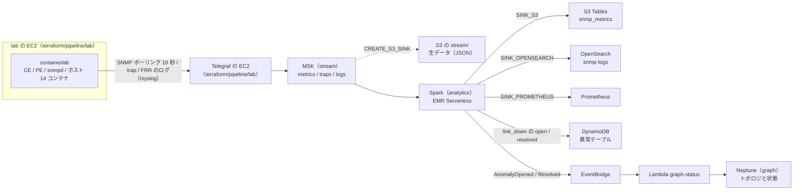

# パイプライン（PIPELINE）

← [README](../README.md)

`<prefix>` は `deploy.env` の `OWNER` から作る接頭辞 `<owner>-nwc-poc`。`deploy.env` に `PIPELINE=1` を書いて `ops/up.sh` を打つと、下の全部ができる。



- lab は Web やエージェントとはつながっていない。使うのは SNMP とログの発生源としてだけ。
- Telegraf は lab とは別の EC2 で動く（stream を作るときだけ。`terraform/pipeline/lab` の `create_telegraf`）。Telegraf だけを止める・作り直す・ログを見ることができる。
- 機器は lab の EC2 の中の docker network（`203.0.113.0/24`）にいる。Telegraf の EC2 からのポーリングは VPC のルートで lab の EC2 を通り、trap は lab の EC2 が Telegraf へ DNAT し、FRR のログは lab の EC2 の rsyslog が Telegraf の `5140/tcp` へ送る。この 3 つは lab の EC2 で `sudo lab forward` が張る（`lab up` が毎回呼ぶ）。
- 履歴の正本は S3 Tables。Web の「異常一覧」とエージェントの `list_anomalies` は DynamoDB を読む。
- Neptune が無いとき（`SKIP_GRAPH=1`）は、トポロジは `agent/data/` の静的データになる。

## lab に入る

lab の EC2 に入るには管理者用のシェルセッション（`SSM-SessionManagerRunShell`）が要る。

```bash
LAB_INSTANCE_ID=$(terraform -chdir=terraform/pipeline/lab output -raw lab_instance_id); echo "$LAB_INSTANCE_ID"
aws ssm start-session --region ap-northeast-1 --target "$LAB_INSTANCE_ID"
```

入ったら、セッションの中で打つ。

| コマンド | 何をする |
|---|---|
| `sudo lab status` | 14 コンテナが running か |
| `sudo lab check` | BGP の隣接、経路、拠点間の ping、SNMP |
| `sudo lab failover` | 本社の主回線を落とし、副回線に切り替わるのを見る（30〜60 秒） |
| `sudo lab heal-main` / `sudo lab fail-main` | 主回線を戻す / 落とすだけ |
| `sudo lab snmp hq-snmp-01` | 1 台の ifDescr と ifOperStatus |
| `sudo lab logs` | FRR のログの末尾。1 台だけなら `sudo lab logs hq-ce-01`、行数は `LINES=50` を前に付ける |
| `sudo lab forward-status` | Telegraf の EC2 への転送（iptables の規則と rsyslog）。張り直すのは `sudo lab forward` |
| `sudo lab clab inspect --all` | containerlab をそのまま呼ぶ |

- 機器の CLI: `sudo docker exec -it clab-wanlab-hq-ce-01 vtysh`（1 行だけなら `-c 'show bgp summary'`）
- `sudo lab failover` を打つと、trap が 5 秒以内、ポーリングの `link_down` が 10 秒以内に出る。`sudo lab heal-main` で resolved に戻る。
- FRR のログは lab の EC2 の `/var/log/netops-lab/<機器名>/frr.log`。rsyslog が 1 行ずつ機器名を付けて Telegraf へ送り、Telegraf がトピック `logs` に出す（measurement は `frr_log`）。

## Telegraf に入る

```bash
TELEGRAF_INSTANCE_ID=$(terraform -chdir=terraform/pipeline/lab output -raw telegraf_instance_id); echo "$TELEGRAF_INSTANCE_ID"
aws ssm start-session --region ap-northeast-1 --target "$TELEGRAF_INSTANCE_ID"
```

| コマンド | 何をする |
|---|---|
| `sudo tg status` | unit の状態、trap（`162/udp`）と FRR のログ（`5140/tcp`）を受けているか、lab の EC2 から rsyslog がつながっているか、直近のログ |
| `sudo tg test` | SNMP のポーリングを 1 回だけまわして画面に出す（MSK には送らない） |
| `sudo tg logs` | unit のログ。行数は `LINES=200` を前に付ける |
| `sudo tg restart` | Telegraf だけを再起動する（`ExecStartPre` の `tg render` で MSK のブローカーを読み直す） |

- 設定のテンプレートは `telegraf/telegraf.conf.in`。変えたときは下の「変えたとき」。
- `sudo tg test` で機器に届かない、trap が来ない、ログが来ないときは、lab の EC2 で `sudo lab forward-status` を見る（規則が無ければ `sudo lab forward`）。

### 動かないとき

```bash
systemctl is-active <prefix>-lab rsyslog
sudo journalctl -u <prefix>-lab -n 50 --no-pager
sudo tail -n 50 /var/log/cloud-init-output.log
sudo systemctl restart <prefix>-lab
```

- ECR からイメージを取れない（`docker pull` がタイムアウトする）: `terraform/base/core` の `create_shared_endpoints` が `true` か、エンドポイントの SG に lab からの 443 があるかを見る。
- snmpd のビルドで `apk add` が証明書で落ちる: 社内のルート証明書を `lab/snmpd/certs/` に置いて打ち直す。

### 止める・起動する

出力の `stop_command` / `start_command` を打つ。止めている間は EBS 16 GB の保管料だけ。

```bash
terraform -chdir=terraform/pipeline/lab output -raw stop_command; echo
```

## Spark を確かめる

ジョブの一覧とテーブルの一覧は出力のコマンドで見る。テーブルの中身は Athena で見る（カタログは `s3tablescatalog`）。

```bash
terraform -chdir=terraform/pipeline/analytics output -raw list_job_runs_command; echo
terraform -chdir=terraform/pipeline/analytics output -raw list_tables_command; echo
```

Spark UI を開く（EMR Studio は要らない）:

```bash
APP_ID=$(terraform -chdir=terraform/pipeline/analytics output -raw application_id); echo "$APP_ID"
JOB_RUN_ID=$(aws emr-serverless list-job-runs --region ap-northeast-1 --application-id "$APP_ID" --states RUNNING --query 'jobRuns[0].id' --output text); echo "$JOB_RUN_ID"
aws emr-serverless get-dashboard-for-job-run --region ap-northeast-1 --application-id "$APP_ID" --job-run-id "$JOB_RUN_ID" --query url --output text
```

- **URL は一時的な認証を含み、約 1 時間で切れる。チャットやチケットに貼らない。**
- 見るタブは「Structured Streaming」（バッチごとの入力行数と処理時間）と「Executors」。
- `$JOB_RUN_ID` が `None` なら動いているジョブが無い。

CLI だけで見るとき:

```bash
aws emr-serverless get-job-run --region ap-northeast-1 --application-id "$APP_ID" --job-run-id "$JOB_RUN_ID" --query 'jobRun.[state,stateDetails,totalExecutionDurationSeconds]' --output table
LOG_GROUP=$(terraform -chdir=terraform/pipeline/analytics output -raw log_group_name); aws logs tail "$LOG_GROUP" --region ap-northeast-1 --since 10m --follow
```

- `FAILED` なら、ロググループ `/aws/emr-serverless/<prefix>` のドライバーの stderr を見る。
- ジョブは同時に 1 本だけにする（同じチェックポイントを 2 本で書くと壊れる）。`ops/up.sh` の手順 7-5 は、スクリプトと引数のハッシュをジョブのタグ `SpecHash` に付けて起こし、動いているジョブのタグが今のハッシュと同じなら何もせず、違えば止めて（最大 3 分待つ）起こし直す。
- 4 本のクエリ（iceberg / opensearch / prometheus / detect）のどれかが止まると、ジョブを終わらせ（exit 1）、STREAMING モードに起こし直させる。チェックポイントの続きから読むので、取りこぼしも二重も無い。起こし直しは既定で 1 時間に 5 回まで（超えると `FAILED`）。
- チェックポイントは MSK クラスタごとのパス（`checkpoints/<クラスタの uuid>/`）。MSK を作り直すと、前のクラスタのオフセットを読まずに新しいパスから始まる。
- analytics を消すと S3 Tables の履歴も消える。

## Neptune のトポロジ

Neptune に入れる機器・インタフェース・回線は、lab の定義（`lab/wanlab.clab.yml.in` と `lab/frr/<機器>.conf`）から `lab/lab_topology.py` が作る。インタフェースはリンクの両端だけでなく管理の eth0 なども全部入れる。`ops/up.sh` は Spark のジョブを起こす前に、Neptune が空のときだけ入れる。

同じ定義から、Telegraf のポーリング先（`--snmp-agents` → `s3://<バケット>/telegraf/snmp_agents.txt`）と、Spark の検知が trap の送り元を機器名に直す device map（`--device-map`。hostname・管理 IP・全インタフェースのアドレス → 機器名）も作る。機器の一覧はこの 1 か所だけにある。

```bash
ops/sync-graph.sh              # 空のときに入れる
ops/sync-graph.sh --replace    # 全部消して入れ直す（lab の定義を変えたとき）
ops/sync-graph.sh --dry-run    # 作った JSON を出すだけ
```

- Web の「トポロジ」タブの「静的データを投入」は `agent/data/` を入れる。同じタブでリンクの追加と削除もできる。
- 状態は Lambda `<prefix>-graph-status` が書く。`link_down` なら回線の辺に `DOWN` / `UP`、ほかの trap なら機器に `ALARM` / `UP`（`UP` に戻すのは機器が `ALARM` のときだけ。IF の分からない linkDown の `DOWN` は残す）。
- link 以外の trap には「直った」の知らせが無いので、最後の trap から 10 分で resolved にする（Spark が 1 分おきに見回る）。coldStart / warmStart と snmpd の停止・再起動の通知（nsNotifyShutdown / nsNotifyRestart）は異常にしない。調査ワークフローを起こすのは `link_down` だけ。
- 入れ直すと状態は全部 `UP` に戻る。
- トポロジに無い機器やインタフェースの異常は捨てず、「未登録」の頂点（`registered=false`、機器は `role=unknown`）として残す。Web の図では橙の点線の枠、表の「監視」は「未登録」になる。Lambda のログには WARNING で `UNREGISTERED` が出る。lab に足した機器なら `ops/sync-graph.sh --replace` で登録すると置き換わり、`UP` でない状態は引き継ぐ。

## 変えたとき

| 変えたもの | やること |
|---|---|
| `lab/` の設定（`lab/frr/` など） | `ops/up.sh` を打つ（手順 5 で S3 に置き直す）→ lab に入って `sudo systemctl restart <prefix>-lab` |
| `telegraf/telegraf.conf.in` | `ops/up.sh` を打つ（手順 5 で `s3://<バケット>/telegraf/` に置き直す）→ `aws ec2 reboot-instances --region ap-northeast-1 --instance-ids "$TELEGRAF_INSTANCE_ID"`（起動のたびに S3 から取り直す）。lab の EC2 はそのまま |
| `spark/snmp_sinks.py` | `ops/up.sh` を打つ（手順 7-5 がハッシュの違いを見て、動いているジョブを止めて起こし直す）。手で止めるコマンドは下 |
| lab の機器や回線 | 上のあと `ops/sync-graph.sh --replace`。監視する機器を足したら Telegraf の EC2 も再起動（ポーリング先を取り直す）し、`ops/up.sh`（device map はジョブの引数なので、変われば手順 7-5 がジョブを起こし直す） |

ジョブを止めるコマンド（`$APP_ID` と `$JOB_RUN_ID` は上の「Spark を確かめる」で入れる）:

```bash
aws emr-serverless cancel-job-run --region ap-northeast-1 --application-id "$APP_ID" --job-run-id "$JOB_RUN_ID"
```
