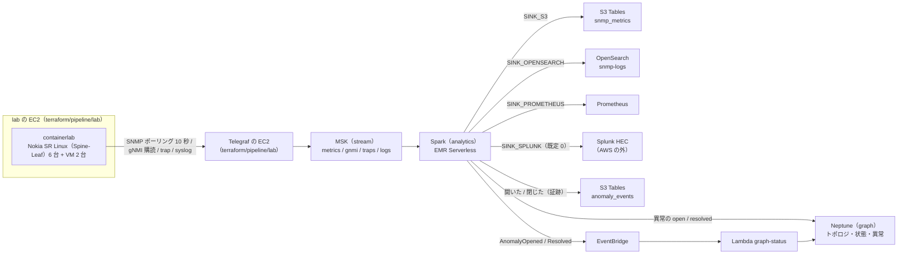

# パイプライン（PIPELINE）

← [README](../README.md)

`<prefix>` は `deploy.env` の `OWNER` から作る接頭辞 `<owner>-nwc-poc`。`deploy.env` に `PIPELINE=1` を書いて `ops/up.sh` を打つと、下の全部ができる。


```mermaid
flowchart LR
  subgraph LABEC2["lab の EC2（terraform/pipeline/lab）"]
    CLAB["containerlab<br/>Nokia SR Linux（Spine-Leaf）6 台 + VM 2 台"]
  end
  CLAB -->|"SNMP ポーリング 10 秒 / gNMI 購読 / trap / syslog"| TG["Telegraf の EC2<br/>（terraform/pipeline/lab）"]
  TG --> MSK["MSK（stream）<br/>metrics / gnmi / traps / logs"]
  MSK --> SPARK["Spark（analytics）<br/>EMR Serverless"]
  SPARK -->|"SINK_S3"| ICE["S3 Tables<br/>snmp_metrics"]
  SPARK -->|"SINK_OPENSEARCH"| OS["OpenSearch<br/>snmp-logs"]
  SPARK -->|"SINK_PROMETHEUS"| PROM["Prometheus"]
  SPARK -->|"SINK_SPLUNK（既定 0）"| SPL["Splunk HEC<br/>（AWS の外）"]
  SPARK -->|"開いた / 閉じた（証跡）"| AEV["S3 Tables<br/>anomaly_events"]
  SPARK -->|"異常の open / resolved"| NEP["Neptune（graph）<br/>トポロジ・状態・異常"]
  SPARK -->|"AnomalyOpened / Resolved"| EB["EventBridge"]
  EB --> GL["Lambda graph-status"] --> NEP
```

- lab は Web やエージェントとはつながっていない。使うのは SNMP とログの発生源としてだけ。
- Telegraf は lab とは別の EC2 で動く（stream を作るときだけ。`terraform/pipeline/lab` の `create_telegraf`）。Telegraf だけを止める・作り直す・ログを見ることができる。
- lab は Spine-Leaf（EVPN-VXLAN）。上流側の Leaf-SW 2 台と アクセス側の Leaf 2 台が Spine 2 台とフルメッシュ（fabric。IS-IS）、上流 VM は Leaf-SW の組へ、アクセス側 VM は Leaf の組へ LAG（EVPN マルチホーミング）で 2 本ずつ。機器の定義は `lab/gen_lab.py` が作る（[lab を変える](#lab-を変える)）。SR-MPLS は SR Linux のコンテナが `ixr6e` / `ixr10e` + ライセンスを要るので、ライセンスが届くまで license 不要の `ixr-d2l` で EVPN-VXLAN にしている。
- 機器は lab の EC2 の中の docker network（`203.0.113.0/24`）にいる。Telegraf の EC2 からの SNMP のポーリング（`161/udp`）と gNMI の購読（`57400/tcp`）は VPC のルートで lab の EC2 を通り、trap（`162/udp`）と syslog（`5140/udp`）は機器が lab の EC2（`203.0.113.1`）へ送り、lab の EC2 が Telegraf へ DNAT する。この 4 つは lab の EC2 で `sudo lab forward` が張る（`lab up` が毎回呼ぶ）。
- gNMI（Telegraf の `inputs.gnmi`）は BGP の `session-state` と IS-IS の IF の `oper-state`（隣接そのもの（`interface/adjacency`）は落ちると down を経ずに消え、Telegraf は gNMI の delete を載せないので取らない）を on_change で、EVPN の ethernet-segment の `oper-state` と MAC テーブルを 30 秒おきに取り、トピック `gnmi` に出す。Spark はここから `bgp_down`（相手の IP が対象）と `isis_down`（サブインタフェースが対象）を出す。
- Spark は起動時に、読むトピック（`metrics` / `gnmi` / `traps` / `logs`）のうち無いものを作る（`snmp_sinks.py` の `ensure_topics`。EMR のロールに `kafka-cluster:CreateTopic`）。MSK の `auto.create.topics.enable=true` は書き込みのときにしか効かず、Telegraf が最初の trap / syslog を出すまで `traps` / `logs` が無い。無いトピックを購読するとジョブは offset 読みで落ちて、起こし直しの上限（1 時間 5 回）を使い切る（2026-09-27 に実測）。
- 履歴の正本は S3 Tables。異常の「いま」は Neptune の頂点 `anomaly` で、Web の「異常一覧」とエージェントの `list_anomalies` はそれを読む。開いた・閉じたの履歴は `anomaly_events` に残る（[data-stores.md](data-stores.md)）。
- 検知が Neptune に書くので、analytics は graph が要る。`SKIP_GRAPH=1` にするなら `SKIP_ANALYTICS=1` も書く（トポロジは `agent/data/` の静的データになり、異常一覧は出ない）。
- テーブルバケットは `SINK_S3=0` でも作る（証跡の置き場）。`ops/down.sh` はバケットごと消すので、証跡も消える。
- Splunk（`SINK_SPLUNK=1`）は Spark の driver が全トピックを HTTP Event Collector（HEC）に POST する（2026-09-26 に MSK Connect の Splunk Connect for Kafka をやめて、ほかの格納先と同じ形にした）。Splunk 自体は作らない。
  - token は `deploy.env` に書かず、`ops/up.sh` を打つ前に SSM の SecureString `/<接頭辞>/splunk/hec-token` に手で入れる（`aws ssm put-parameter --type SecureString`）。`ops/up.sh` は手順 7-4 で有無だけ確かめ、ジョブが起動時に 1 回読む。Terraform も引数もログも値を持たない。
  - Spark は NAT Gateway で外に出るので、Splunk Cloud の公開 HEC にも、DX / VPN の先の社内の Splunk Enterprise にも届く（SG は全部出せるので HEC のポートは何番でもよい）。2026-09-26 までは VPC に NAT も IGW も無く、VPC の中から届く Splunk に限っていた。
  - HEC が 4xx を返したまとまり（最大 500 件）は捨ててログに出し、ジョブは止めない。5xx は再送する。

## lab に入る

lab の EC2 に入るには管理者用のシェルセッション（`SSM-SessionManagerRunShell`）が要る。

```bash
LAB_INSTANCE_ID=$(terraform -chdir=terraform/pipeline/lab output -raw lab_instance_id); echo "$LAB_INSTANCE_ID"
aws ssm start-session --region ap-northeast-1 --target "$LAB_INSTANCE_ID"
```

入ったら、セッションの中で打つ。

| コマンド | 何をする |
|---|---|
| `sudo lab status` | 8 コンテナが running か |
| `sudo lab check` | BGP EVPN の隣接（Spine の RR）、IS-IS の隣接、EVPN の ethernet-segment、VM の LAG（bond0）、VM 同士の ping、SNMP |
| `sudo lab failover` | アクセス側 Leaf の fabric（`dc1-leaf-01 ethernet-1/1`）を落とし、経路が `dc1-spine-02` だけに切り替わるのを見る（最大 60 秒） |
| `sudo lab heal-main` / `sudo lab fail-main` | その fabric を戻す / 落とすだけ |
| `sudo lab snmp dc1-leaf-01` | 1 台の ifName / ifAdminStatus / ifOperStatus（EC2 から snmpwalk。admin up の IF だけ） |
| `sudo lab logs` | 機器のログ（`/var/log/srlinux/file/messages`）の末尾。1 台だけなら `sudo lab logs dc1-leaf-01`、行数は `LINES=50` を前に付ける |
| `sudo lab cli dc1-leaf-01 "show network-instance default protocols bgp neighbor"` | 1 台に SR Linux の CLI を 1 つ打つ |
| `sudo lab forward-status` | Telegraf の EC2 への転送（iptables の規則と、機器側の remote-server / trap-group）。張り直すのは `sudo lab forward` |
| `sudo lab clab inspect --all` | containerlab をそのまま呼ぶ |

- 機器の CLI: `sudo docker exec -it clab-splab-dc1-leaf-01 sr_cli`（1 行だけなら `sudo lab cli dc1-leaf-01 "show ..."`）。設定は `lab/srlinux/<機器>.cli`（`set /` の行だけ。containerlab が起動時に流し込む。手で直さず `lab/gen_lab.py` で作り直す）
- `sudo lab failover` を打つと、trap が 5 秒以内に Kafka に届き、次の検知バッチ（トリガー 60 秒）で `link_down`（物理 IF とサブインタフェース）と gNMI の `isis_down` が開く。`sudo lab heal-main` で resolved に戻る（2026-09-27 に EC2 で確認）。
  - SR Linux の SNMP の `ifOperStatus` は実際の oper-state より 15〜20 秒遅れる（2026-09-27 実測）。検知はバッチ内で時刻順の最後の状態を採るので、落ちてから 1 分ほどで戻すと、遅れたポーリングの up が trap の linkDown より後になり、物理 IF の `link_down` は開かないことがある。サブインタフェースの `link_down`（trap）と `isis_down`（gNMI）は開く。確かめるときは 2 分以上落としておく。
- 機器のログは SR Linux の `system logging remote-server`（RFC 5424、udp）で lab の EC2 へ出て、Telegraf の `inputs.syslog` が受け、トピック `logs` に出す（measurement は `device_log`。hostname は `sysName` タグに付け替える）。送る subsystem は bgp / chassis / linux / netinst / xdp。
- SNMP は containerlab が全ノードに v2c の community `public` を入れ、gNMI も全ノードで `57400/tcp`（TLS、containerlab の既定の admin）に開く。監視対象は `lab/srlinux/<機器>.cli` の `system snmp trap-group`（trap の宛先）の有無で決まり、いまは SR Linux の 6 台全部。VM 2 台は対象外。
- SR Linux の ifTable は未使用の物理ポートも全部出す（`ifAdminStatus` が down）。IF の鍵は `ifName`（`ifDescr` は「名前 + description」）。Spark は admin down の行とサブインタフェース（`ethernet-1/1.0`）を見ない。

## Telegraf に入る

```bash
TELEGRAF_INSTANCE_ID=$(terraform -chdir=terraform/pipeline/lab output -raw telegraf_instance_id); echo "$TELEGRAF_INSTANCE_ID"
aws ssm start-session --region ap-northeast-1 --target "$TELEGRAF_INSTANCE_ID"
```

| コマンド | 何をする |
|---|---|
| `sudo tg status` | unit の状態、trap（`162/udp`）と syslog（`5140/udp`）を受けているか、直近のログ |
| `sudo tg test` | SNMP のポーリングを 1 回だけまわして画面に出す（MSK には送らない） |
| `sudo tg gnmi` | gNMI の購読を 15 秒だけ受けて画面に出す（MSK には送らない。BGP / IS-IS の行が出れば届いている） |
| `sudo tg logs` | unit のログ。行数は `LINES=200` を前に付ける |
| `sudo tg restart` | Telegraf だけを再起動する（`ExecStartPre` の `tg render` で MSK のブローカーを読み直す） |

- 設定のテンプレートは `telegraf/telegraf.conf.in`。変えたときは下の「変えたとき」。
- `sudo tg test` で機器に届かない、trap が来ない、ログが来ないときは、lab の EC2 で `sudo lab forward-status` を見る（規則が無ければ `sudo lab forward`）。

### 動かないとき

```bash
systemctl is-active <prefix>-lab
sudo journalctl -u <prefix>-lab -n 50 --no-pager
sudo tail -n 50 /var/log/cloud-init-output.log
sudo systemctl restart <prefix>-lab
```

- ECR からイメージを取れない（`docker pull` がタイムアウトする）: プライベートのルートテーブルに `0.0.0.0/0 → NAT Gateway` があるか（`terraform/base/core` の `aws_route.private_default`）、NAT Gateway が `available` かを見る。
- SR Linux が起きない（`containerlab deploy` が readiness で止まる）: 6 台で 10 GB ほど使うので `free -m` を見る。`t4g.large` では足りない（既定は `t4g.xlarge`）。1 台の起動ログは `sudo docker logs clab-splab-dc1-leaf-01`。
- VM の `bond0` が無い（`sudo lab check` の LAG が「bond0 が無い」）: EC2 のカーネルに bonding モジュールが要る。`lsmod | grep bonding`、無ければ `sudo modprobe bonding`（`terraform/pipeline/lab` の user data が起動時に入れる）。
- 設定が入らない（deploy が `startup-config` で失敗する）: `lab/srlinux/<機器>.cli` の行を `sudo lab cli <機器>` で 1 行ずつ流して、どの行で落ちるかを見る。

### 止める・起動する

出力の `stop_command` / `start_command` を打つ。止めている間は EBS 24 GB の保管料だけ。

```bash
terraform -chdir=terraform/pipeline/lab output -raw stop_command; echo
```

## Spark を確かめる

ジョブの一覧とテーブルの一覧は出力のコマンドで見る。テーブルの中身は Athena で見る（カタログは `s3tablescatalog`）。

```bash
terraform -chdir=terraform/pipeline/analytics output -raw list_job_runs_command; echo
terraform -chdir=terraform/pipeline/analytics output -raw list_tables_command; echo
```

Spark UI を開く（EMR Studio は要らない）:

```bash
APP_ID=$(terraform -chdir=terraform/pipeline/analytics output -raw application_id); echo "$APP_ID"
JOB_RUN_ID=$(aws emr-serverless list-job-runs --region ap-northeast-1 --application-id "$APP_ID" --states RUNNING --query 'jobRuns[0].id' --output text); echo "$JOB_RUN_ID"
aws emr-serverless get-dashboard-for-job-run --region ap-northeast-1 --application-id "$APP_ID" --job-run-id "$JOB_RUN_ID" --query url --output text
```

- **URL は一時的な認証を含み、約 1 時間で切れる。チャットやチケットに貼らない。**
- 見るタブは「Structured Streaming」（バッチごとの入力行数と処理時間）と「Executors」。
- `$JOB_RUN_ID` が `None` なら動いているジョブが無い。

CLI だけで見るとき:

```bash
aws emr-serverless get-job-run --region ap-northeast-1 --application-id "$APP_ID" --job-run-id "$JOB_RUN_ID" --query 'jobRun.[state,stateDetails,totalExecutionDurationSeconds]' --output table
LOG_GROUP=$(terraform -chdir=terraform/pipeline/analytics output -raw log_group_name); aws logs tail "$LOG_GROUP" --region ap-northeast-1 --since 10m --follow
```

- `FAILED` なら、ロググループ `/aws/emr-serverless/<prefix>` のドライバーの stderr を見る。
- ジョブは同時に 1 本だけにする（同じチェックポイントを 2 本で書くと壊れる）。`ops/up.sh` の手順 7-5 は、スクリプトと引数のハッシュをジョブのタグ `SpecHash` に付けて起こし、動いているジョブのタグが今のハッシュと同じなら何もせず、違えば止めて（最大 3 分待つ）起こし直す。
- 格納先ごとのクエリ（iceberg / opensearch / prometheus / splunk）と detect のどれかが止まると、ジョブを終わらせ（exit 1）、STREAMING モードに起こし直させる。チェックポイントの続きから読むので、取りこぼしも二重も無い。起こし直しは既定で 1 時間に 5 回まで（超えると `FAILED`）。
- チェックポイントは MSK クラスタごとのパス（`checkpoints/<クラスタの uuid>/`）。MSK を作り直すと、前のクラスタのオフセットを読まずに新しいパスから始まる。
- analytics を消すと S3 Tables の履歴も消える。

## Neptune のトポロジ

Neptune に入れる機器・インタフェース・回線（物理層）と、その上の IP 層・EVPN/BGP 層は、lab の定義（`lab/splab.clab.yml.in` と `lab/srlinux/<機器>.cli`）から `lab/lab_topology.py` が作る。インタフェースはリンクの両端だけでなく管理の `mgmt0` や `lag1` も全部入れる（ループバック `system0` は物理層に数えない）。IF 名は機器の名前（`ethernet-1/1`。containerlab の `e1-1` から直す）。`ops/up.sh` は Spark のジョブを起こす前に、Neptune が空のときだけ入れる。

層は 3 つで、上の層の頂点は下の層の頂点の id を property に持つ（層をまたいで追える ID。[data-stores.md](data-stores.md#neptune-の層)）。

| 層 | 頂点（label） | id | 下の層を指す property |
|---|---|---|---|
| 物理 | `device` / `interface` | `<機器>` / `<機器>#<IF>` | — |
| IP | `ip_interface`（アドレス付きサブインタフェース） / `isis_adjacency` | `<機器>#<IF>.0` / `<機器>#isis#<IF>.0` | `interface_id` / `ip_interface_id` |
| EVPN・BGP | `bgp_session` / `evpn_instance` / `ethernet_segment` | `<機器>#bgp#<相手の IP>` / `<機器>#evi#<EVI>` / `<機器>#es#<名前>` | `ip_interface_id`（ループバック `system0.0`） / `interface_id`（`lag1`） |

同じ定義から、Telegraf のポーリング先（`--snmp-agents` → `s3://<バケット>/telegraf/snmp_agents.txt`）、gNMI の購読先（`--gnmi-targets` → `s3://<バケット>/telegraf/gnmi_targets.txt`）と、Spark の検知が trap の送り元を機器名に直す device map（`--device-map`。hostname・管理 IP・全インタフェースのアドレス → 機器名）も作る。機器の一覧はこの 1 か所だけにある。

```bash
ops/sync-graph.sh              # 空のときに入れる
ops/sync-graph.sh --replace    # 全部消して入れ直す（lab の定義を変えたとき）
ops/sync-graph.sh --dry-run    # 作った JSON を出すだけ
```

- Web の「トポロジ」タブの「静的データを投入」は `agent/data/` を入れる。同じタブでリンクの追加と削除もできる。
- 状態は Lambda `<prefix>-graph-status` が書く。`link_down` なら回線の辺に `DOWN` / `UP`、`bgp_down` / `isis_down`（gNMI）なら上の層の頂点 `bgp_session` / `isis_adjacency` に `DOWN` / `UP`、ほかの trap なら機器に `ALARM` / `UP`（`UP` に戻すのは機器が `ALARM` のときだけ。IF の分からない linkDown の `DOWN` は残す）。
- link 以外の trap には「直った」の知らせが無いので、最後の trap から 10 分で resolved にする（Spark が 1 分おきに見回る）。coldStart / warmStart は異常にしない。調査ワークフローを起こすのは `link_down` だけ。
- 入れ直すと状態は全部 `UP` に戻る（上の層も入れ直す。`ops/sync-graph.sh --replace`）。
- トポロジに無い機器やインタフェースの異常は捨てず、「未登録」の頂点（`registered=false`、機器は `role=unknown`）として残す。Web の図では橙の点線の枠、表の「監視」は「未登録」になる。Lambda のログには WARNING で `UNREGISTERED` が出る。lab に足した機器なら `ops/sync-graph.sh --replace` で登録すると置き換わり、`UP` でない状態は引き継ぐ。

## lab を変える

`lab/splab.clab.yml.in` と `lab/srlinux/*.cli` は `lab/gen_lab.py` の出力で、手で直さない（`tests/test_sync.py` が出力と同じことを確かめる）。台数を変えるときは回し直して、`agent/data/` の静的データも作り直す。

```bash
uv run python lab/gen_lab.py --leaves 2 --spines 2      # 既定と同じ。--leaves 4 なら Leaf 4 台
uv run python lab/lab_topology.py lab --layers > agent/data/layers.json
```

- 大きくするときは Leaf を増やす（2 台 1 組。EVPN マルチホーミングの組ごとに VM が 1 台付く）。Spine は `--spines`。実機に置き換えるときは Leaf 2 台を想定している。
- SR-MPLS に替えるとき（ライセンスが届いたら）: `gen_lab.py` の `type: ixr-d2l` を `ixr6e` にし、VXLAN の `vxlan-interface` / `tunnel-interface` を SR（IS-IS の segment-routing）と `mpls` の network-instance に置き換える。トポロジと Neptune の層は変わらない。

## 変えたとき

| 変えたもの | やること |
|---|---|
| `lab/` の設定（`lab/gen_lab.py` を回したあと） | `ops/up.sh` を打つ（手順 5 で S3 に置き直す）→ lab に入って `sudo systemctl restart <prefix>-lab` |
| `telegraf/telegraf.conf.in` | `ops/up.sh` を打つ（手順 5 で `s3://<バケット>/telegraf/` に置き直す）→ `aws ec2 reboot-instances --region ap-northeast-1 --instance-ids "$TELEGRAF_INSTANCE_ID"`（起動のたびに S3 から取り直す）。lab の EC2 はそのまま |
| `spark/snmp_sinks.py` | `ops/up.sh` を打つ（手順 7-5 がハッシュの違いを見て、動いているジョブを止めて起こし直す）。手で止めるコマンドは下 |
| lab の機器や回線 | 上のあと `ops/sync-graph.sh --replace`。監視する機器を足したら Telegraf の EC2 も再起動（ポーリング先と gNMI の購読先を取り直す）し、`ops/up.sh`（device map はジョブの引数なので、変われば手順 7-5 がジョブを起こし直す） |

ジョブを止めるコマンド（`$APP_ID` と `$JOB_RUN_ID` は上の「Spark を確かめる」で入れる）:

```bash
aws emr-serverless cancel-job-run --region ap-northeast-1 --application-id "$APP_ID" --job-run-id "$JOB_RUN_ID"
```
