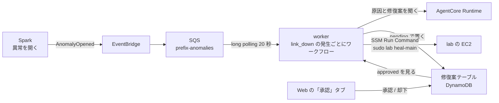
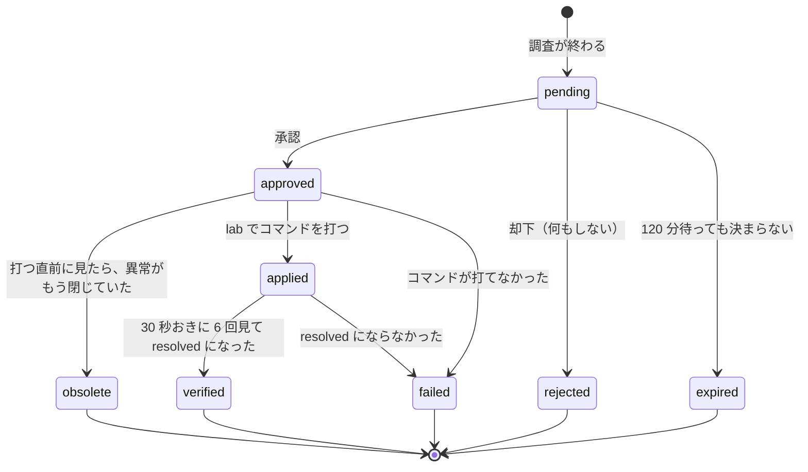

# 調査と修復（WORKFLOW）

← [README](../README.md)

`<prefix>` は `deploy.env` の `OWNER` から作る接頭辞 `<owner>-nwc-poc`。`deploy.env` に `AGENT=1`、`PIPELINE=1`、`WORKFLOW=1` を書いて `ops/up.sh` を打つと、下の全部ができる。

## 流れ



- temporal（`start-dev`、データは SQLite）と worker は、ECS Fargate の 1 タスクに入っている。Temporal の履歴はタスクと一緒に消える。
- Web と worker は修復案テーブルの `status` だけでやり取りする。
- ワークフローと修復案は発生ごと（`investigate-<anomaly_id>#<first_seen>` と `<anomaly_id>#<first_seen>`）。閉じて開き直した次の発生は、前の修復案を上書きせず別の行になる。起こすのは `link_down` だけ（trap は 10 分で自動的に閉じる印なので起こさない）。
- SQS のメッセージは、起こした・起こす理由が無い・同じ発生のワークフローが既に走っている、のどれかなら消す。Temporal や DynamoDB に届かないときは消さずに残し、配り直させる（5 回で DLQ）。
- 同じルートで AgentCore Gateway（MCP）と tools Lambda も作る。Runtime はツールを Gateway 経由で呼ぶ（届かなければコンテナの中のツールで答える）。

## 修復案の状態



## 試す

1. lab に入り（[pipeline.md](pipeline.md) の「lab に入る」）、`sudo lab fail-main` で主回線を落とす。
2. 60 秒ほどで Web の「異常一覧」に出て、数十秒で「承認」タブに修復案（原因・打つコマンド・理由）が `pending` で並ぶ。
3. 下の詳細（原因・コマンド・理由）を読み、名前を入れて「詳細を読んだ」にチェックを入れてから「承認して直す」を押すと `approved` → `applied` → `verified` / `failed` と進む。名前は「決めた人」の列に `<名前> (web)` で残る（Web には認証が無いので、名乗ってもらう）。

## Temporal UI を開く

UI（8233）はプライベートサブネットのタスクにあるので、Web の EC2 を踏み台にしてポートフォワーディングする。`ops/up.sh` の手順 8-5 が同じコマンドを表示する。
通すための SG のルールは `terraform/workflow` の `ecs.tf` にある（Web の SG から出る 8233 と、タスクの SG に入る 8233。どちらも相手の SG に限る）。

```bash
INSTANCE_ID=$(terraform -chdir=terraform/base/core output -raw web_instance_id); echo "$INSTANCE_ID"
WF_CLUSTER=$(terraform -chdir=terraform/workflow output -raw cluster_name); echo "$WF_CLUSTER"
WF_SERVICE=$(terraform -chdir=terraform/workflow output -raw service_name); echo "$WF_SERVICE"
WF_TASK=$(aws ecs list-tasks --region ap-northeast-1 --cluster "$WF_CLUSTER" --service-name "$WF_SERVICE" --query 'taskArns[0]' --output text); echo "$WF_TASK"
WF_TASK_IP=$(aws ecs describe-tasks --region ap-northeast-1 --cluster "$WF_CLUSTER" --tasks "$WF_TASK" --query 'tasks[0].attachments[0].details[?name==`privateIPv4Address`].value | [0]' --output text); echo "$WF_TASK_IP"
aws ssm start-session --region ap-northeast-1 --target "$INSTANCE_ID" --document-name AWS-StartPortForwardingSessionToRemoteHost --parameters "{\"host\":[\"$WF_TASK_IP\"],\"portNumber\":[\"8233\"],\"localPortNumber\":[\"8233\"]}"
```

このあと http://localhost:8233/ を開く。UI に認証は無い（SG で届くのは Web の EC2 からだけ）。

## うまくいかないとき

ワーカーのログ:

```bash
terraform -chdir=terraform/workflow output -raw worker_logs_command; echo
```

| 症状 | 原因と直し方 |
|---|---|
| apply の直後に worker が落ちる | Temporal が上がるまで 1〜3 分かかる。数回落ちてから上がる |
| 承認しても approved のまま進まない（UI で `TimeoutError`） | ワーカーのイメージが古い。`deploy.env` の `IMAGE_TAG` を上げて `ops/up.sh` |
| Runtime のログに `gateway tools/list failed, using local tools` | Gateway に届いていない。答えはコンテナの中のツールで返る |
| 修復案が出ない | Spark のジョブが古いまま動いている（[troubleshooting.md](troubleshooting.md) の「パイプラインと WORKFLOW」） |
| trap の異常に修復案が出ない | 仕様。ワークフローを起こすのは `link_down` だけ（`workflow/rules.py` の `START_KINDS`） |
| 承認したのに `obsolete` になった | 承認までに異常が閉じた（または開き直して別の発生になった）。古い処置は打たない。開き直した発生には別の修復案が出る |
| ポートフォワーディングはつながるが Temporal UI が開かない | 8233 の SG ルール（`terraform/workflow` の `ecs.tf`）が無い。`terraform/workflow` を apply し直す |
